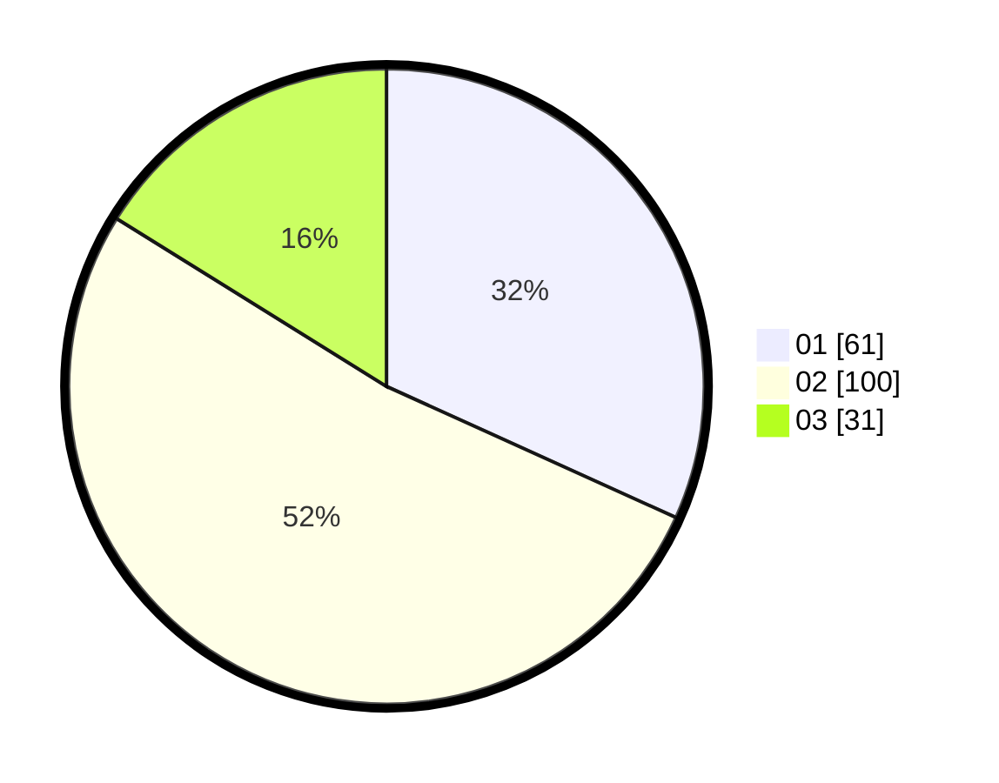

# Hasil

Hasil perolehan suara paslon dapat dilihat pada file paslon-01.txt, paslon-02.txt, dan paslon-03.txt.

Jika tidak ada, artinya data tersebut belum ada pada SIREKAP.

## Perolehan Suara

 * Paslon 01: **61**.
 * Paslon 02: **100**.
 * Paslon 03: **31**.

## Foto C Plano

https://sirekap-obj-formc.kpu.go.id/14d2/pemilu/ppwp/31/73/02/10/06/3173021006083-20240214-203132--7046029a-ac15-416b-ae86-5e84ca0284fe.jpg

https://sirekap-obj-formc.kpu.go.id/14d2/pemilu/ppwp/31/73/02/10/06/3173021006083-20240214-203226--e19d11d6-d9fb-491b-9e36-e512d3b7e5c6.jpg

https://sirekap-obj-formc.kpu.go.id/14d2/pemilu/ppwp/31/73/02/10/06/3173021006083-20240214-203259--71bf85db-5c44-4964-8131-5cec02b89cd5.jpg
