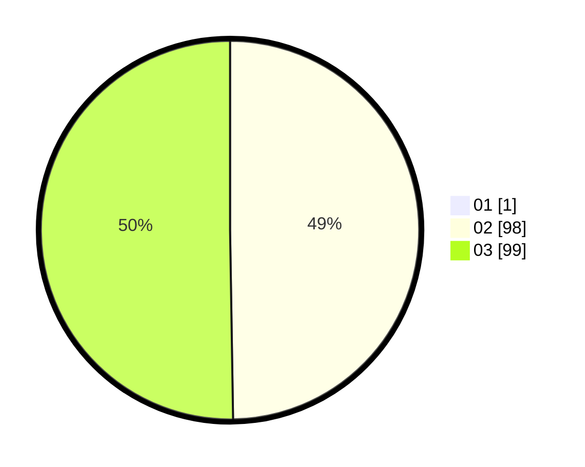

# Hasil

Hasil perolehan suara paslon dapat dilihat pada file paslon-01.txt, paslon-02.txt, dan paslon-03.txt.

Jika tidak ada, artinya data tersebut belum ada pada SIREKAP.

## Perolehan Suara

 * Paslon 01: **1**.
 * Paslon 02: **98**.
 * Paslon 03: **99**.

## Foto C Plano

https://sirekap-obj-formc.kpu.go.id/5d41/pemilu/ppwp/31/73/02/10/06/3173021006092-20240214-190631--62cdd584-2668-4ee0-ace6-f72d7a4a2470.jpg

https://sirekap-obj-formc.kpu.go.id/5d41/pemilu/ppwp/31/73/02/10/06/3173021006092-20240214-190806--d79ae12f-aa6d-4909-a829-34e5a84bf759.jpg

https://sirekap-obj-formc.kpu.go.id/5d41/pemilu/ppwp/31/73/02/10/06/3173021006092-20240214-190918--0d0f7a32-1ca1-47ad-ae46-a1a27b799596.jpg
