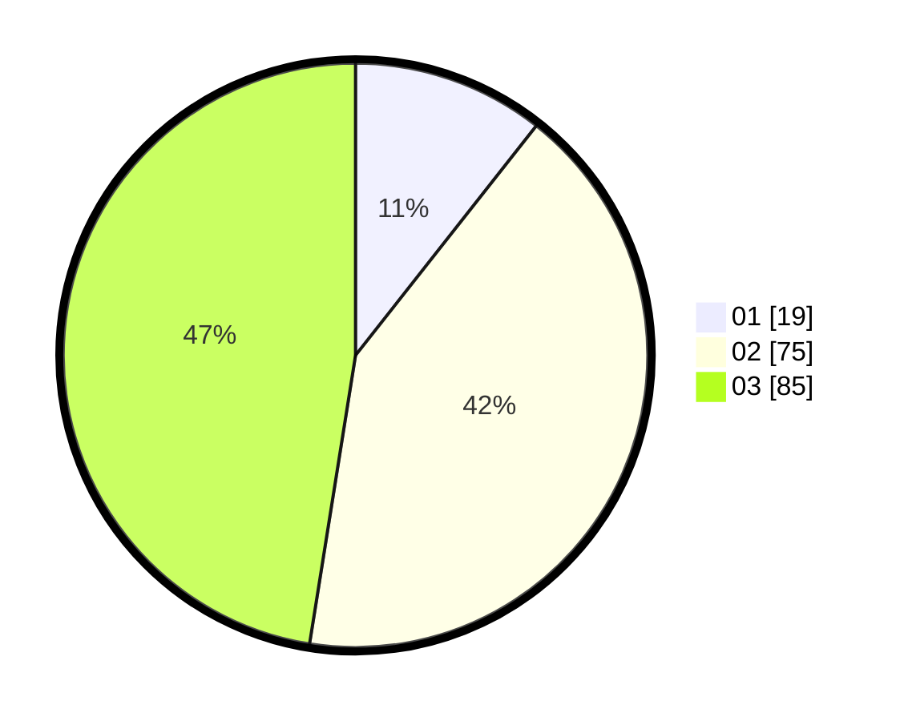

# Hasil

Hasil perolehan suara paslon dapat dilihat pada file paslon-01.txt, paslon-02.txt, dan paslon-03.txt.

Jika tidak ada, artinya data tersebut belum ada pada SIREKAP.

## Perolehan Suara

 * Paslon 01: **19**.
 * Paslon 02: **75**.
 * Paslon 03: **85**.

## Foto C Plano

https://sirekap-obj-formc.kpu.go.id/0a7f/pemilu/ppwp/31/73/02/10/06/3173021006097-20240214-211956--a53be82f-184d-426b-92c7-37a27f3d3bb4.jpg

https://sirekap-obj-formc.kpu.go.id/0a7f/pemilu/ppwp/31/73/02/10/06/3173021006097-20240214-212815--d82e47e0-98eb-4c57-90e6-282fd174677e.jpg

https://sirekap-obj-formc.kpu.go.id/0a7f/pemilu/ppwp/31/73/02/10/06/3173021006097-20240214-213126--13656002-5566-4eef-b049-6ff603cef9f7.jpg
