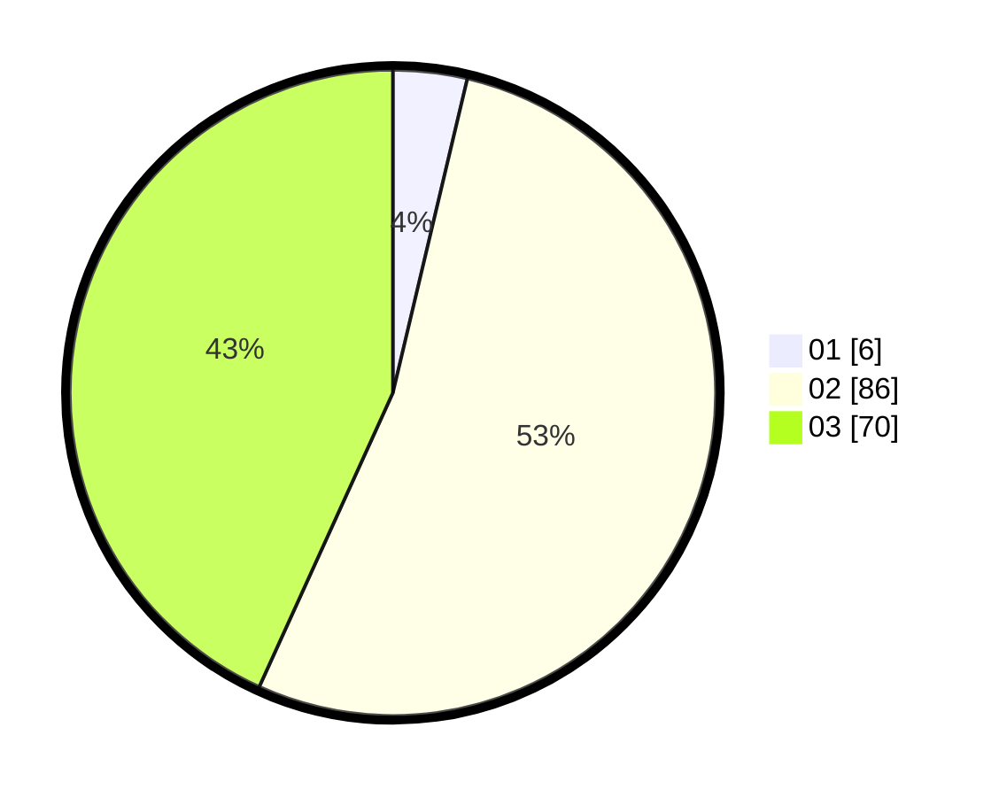

# Hasil

Hasil perolehan suara paslon dapat dilihat pada file paslon-01.txt, paslon-02.txt, dan paslon-03.txt.

Jika tidak ada, artinya data tersebut belum ada pada SIREKAP.

## Perolehan Suara

 * Paslon 01: **6**.
 * Paslon 02: **86**.
 * Paslon 03: **70**.

## Foto C Plano

https://sirekap-obj-formc.kpu.go.id/7466/pemilu/ppwp/31/73/02/10/06/3173021006100-20240214-194219--bfead335-7cce-415d-8f56-0fae5fe07a1e.jpg

https://sirekap-obj-formc.kpu.go.id/7466/pemilu/ppwp/31/73/02/10/06/3173021006100-20240214-200246--b54a53cd-d95c-4a35-a840-601eb6fcf939.jpg

https://sirekap-obj-formc.kpu.go.id/7466/pemilu/ppwp/31/73/02/10/06/3173021006100-20240214-200448--c714159b-1fdd-4f67-9331-cac60ab80767.jpg

## DATA PEMILIH TETAP

Jumlah pemilih dalam DPT: **254**.
 * L: **119**.
 * P: **135**.

## DATA PENGGUNA HAK PILIH

Jumlah pengguna hak pilih dalam DPT: **166**.
 * L: **78**.
 * P: **88**.

Jumlah pengguna hak pilih dalam DPTb: **0**.
 * L: **0**.
 * P: **0**.

Jumlah pengguna hak pilih dalam DPK: **4**.
 * L: **3**.
 * P: **1**.

Jumlah pengguna hak pilih: **170**.
 * L: **81**.
 * P: **89**.

## JUMLAH SUARA SAH DAN TIDAK SAH

JUMLAH SELURUH SUARA SAH: **162**.

JUMLAH SUARA TIDAK SAH: **8**.

JUMLAH SELURUH SUARA SAH DAN SUARA TIDAK SAH: **170**.
