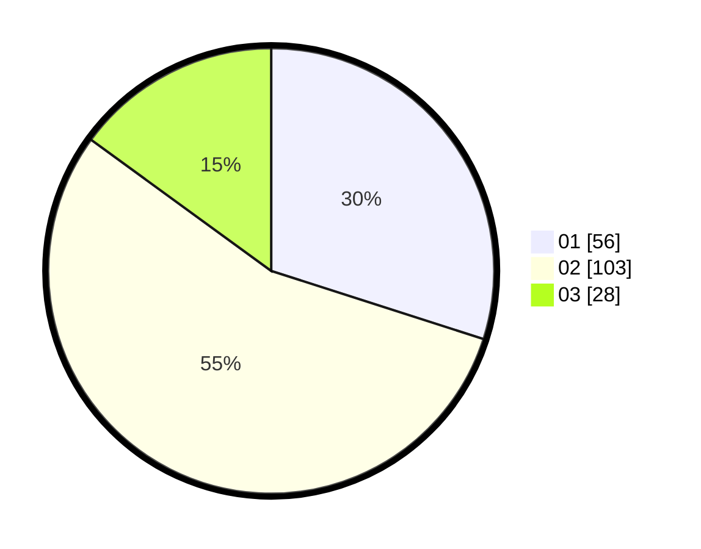

# Hasil

Hasil perolehan suara paslon dapat dilihat pada file paslon-01.txt, paslon-02.txt, dan paslon-03.txt.

Jika tidak ada, artinya data tersebut belum ada pada SIREKAP.

## Perolehan Suara

 * Paslon 01: **56**.
 * Paslon 02: **103**.
 * Paslon 03: **28**.

## Foto C Plano

https://sirekap-obj-formc.kpu.go.id/2f16/pemilu/ppwp/31/73/02/10/06/3173021006102-20240214-200121--79cbdd1c-31ba-4ecf-bf48-9c9fe2a2ba8f.jpg

https://sirekap-obj-formc.kpu.go.id/2f16/pemilu/ppwp/31/73/02/10/06/3173021006102-20240214-201614--09317796-34a7-450f-b746-959572fe31d9.jpg
