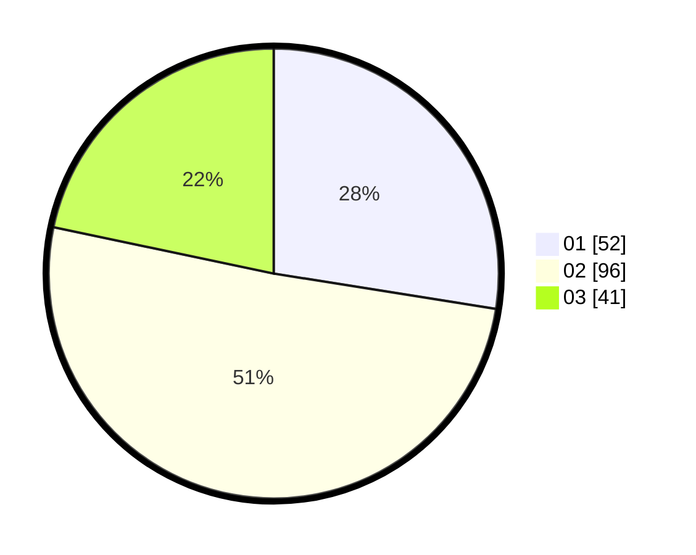

# Hasil

Hasil perolehan suara paslon dapat dilihat pada file paslon-01.txt, paslon-02.txt, dan paslon-03.txt.

Jika tidak ada, artinya data tersebut belum ada pada SIREKAP.

## Perolehan Suara

 * Paslon 01: **52**.
 * Paslon 02: **96**.
 * Paslon 03: **41**.

## Foto C Plano

https://sirekap-obj-formc.kpu.go.id/1e2a/pemilu/ppwp/31/73/02/10/06/3173021006103-20240214-184939--f4aa54bf-bc7f-4d5a-a918-36d1ee483f88.jpg

https://sirekap-obj-formc.kpu.go.id/1e2a/pemilu/ppwp/31/73/02/10/06/3173021006103-20240214-184657--11f343a3-5aa2-4744-9037-420f4ed88e43.jpg

https://sirekap-obj-formc.kpu.go.id/1e2a/pemilu/ppwp/31/73/02/10/06/3173021006103-20240214-155451--a87645bc-6a6f-42c5-b609-85bac804c82d.jpg

## DATA PEMILIH TETAP

Jumlah pemilih dalam DPT: **268**.
 * L: **141**.
 * P: **127**.

## DATA PENGGUNA HAK PILIH

Jumlah pengguna hak pilih dalam DPT: **190**.
 * L: **96**.
 * P: **94**.

Jumlah pengguna hak pilih dalam DPTb: **2**.
 * L: **1**.
 * P: **1**.

Jumlah pengguna hak pilih dalam DPK: **2**.
 * L: **2**.
 * P: **0**.

Jumlah pengguna hak pilih: **194**.
 * L: **99**.
 * P: **95**.

## JUMLAH SUARA SAH DAN TIDAK SAH

JUMLAH SELURUH SUARA SAH: **189**.

JUMLAH SUARA TIDAK SAH: **5**.

JUMLAH SELURUH SUARA SAH DAN SUARA TIDAK SAH: **194**.
