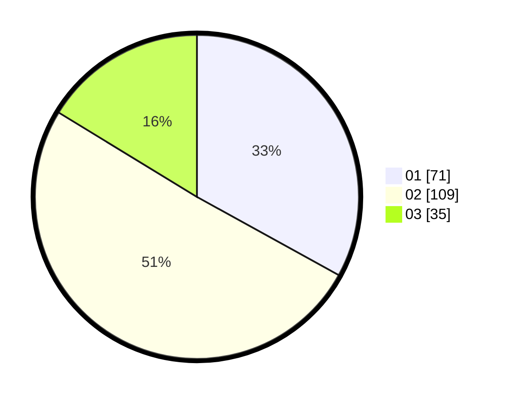

# Hasil

Hasil perolehan suara paslon dapat dilihat pada file paslon-01.txt, paslon-02.txt, dan paslon-03.txt.

Jika tidak ada, artinya data tersebut belum ada pada SIREKAP.

## Perolehan Suara

 * Paslon 01: **71**.
 * Paslon 02: **109**.
 * Paslon 03: **35**.

## Foto C Plano

https://sirekap-obj-formc.kpu.go.id/2c97/pemilu/ppwp/31/73/02/10/06/3173021006104-20240214-192605--f1cb0f25-f8af-42d8-9620-430758517a32.jpg

https://sirekap-obj-formc.kpu.go.id/2c97/pemilu/ppwp/31/73/02/10/06/3173021006104-20240214-194729--10104c79-d26e-475d-a675-62856ecc8032.jpg

https://sirekap-obj-formc.kpu.go.id/2c97/pemilu/ppwp/31/73/02/10/06/3173021006104-20240214-194844--e5373dec-5263-4320-b56d-cc2d4fd92cfe.jpg
