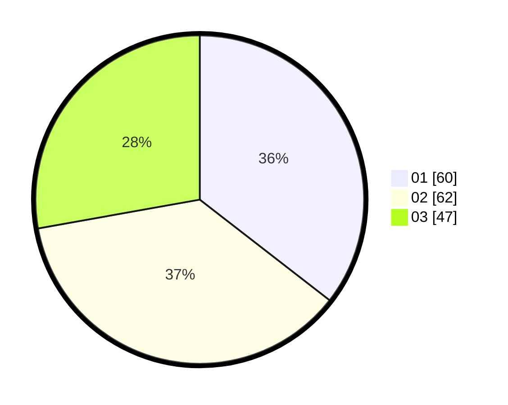

# Hasil

Hasil perolehan suara paslon dapat dilihat pada file paslon-01.txt, paslon-02.txt, dan paslon-03.txt.

Jika tidak ada, artinya data tersebut belum ada pada SIREKAP.

## Perolehan Suara

 * Paslon 01: **60**.
 * Paslon 02: **62**.
 * Paslon 03: **47**.

## Foto C Plano

https://sirekap-obj-formc.kpu.go.id/e119/pemilu/ppwp/31/73/02/10/06/3173021006107-20240214-200648--3fa83059-8dde-4dc7-b5d5-9865e9dc2226.jpg

https://sirekap-obj-formc.kpu.go.id/e119/pemilu/ppwp/31/73/02/10/06/3173021006107-20240214-200631--37183409-9a42-4156-afb6-9a7f0d559e8d.jpg

https://sirekap-obj-formc.kpu.go.id/e119/pemilu/ppwp/31/73/02/10/06/3173021006107-20240214-211711--3c214665-13da-4a90-8cff-73e1d6f4e87f.jpg
