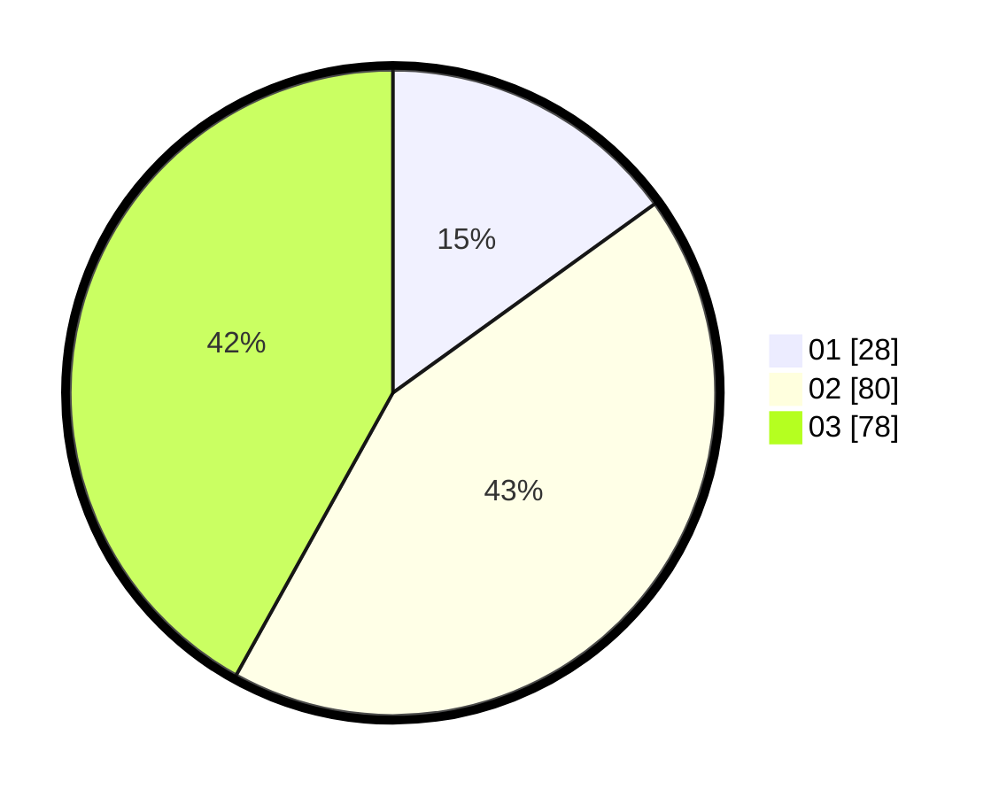

# Hasil

Hasil perolehan suara paslon dapat dilihat pada file paslon-01.txt, paslon-02.txt, dan paslon-03.txt.

Jika tidak ada, artinya data tersebut belum ada pada SIREKAP.

## Perolehan Suara

 * Paslon 01: **28**.
 * Paslon 02: **80**.
 * Paslon 03: **78**.

## Foto C Plano

https://sirekap-obj-formc.kpu.go.id/8b10/pemilu/ppwp/31/73/02/10/06/3173021006111-20240214-211838--ee79a9f2-825d-4c29-99a4-e4293cf9472a.jpg

https://sirekap-obj-formc.kpu.go.id/8b10/pemilu/ppwp/31/73/02/10/06/3173021006111-20240214-212156--8e66b9e6-c47b-4f5f-9fed-c62d0487f942.jpg

https://sirekap-obj-formc.kpu.go.id/8b10/pemilu/ppwp/31/73/02/10/06/3173021006111-20240214-212302--ab6a44e0-595d-44db-b1a2-c8c03abd1701.jpg

## DATA PEMILIH TETAP

Jumlah pemilih dalam DPT: **273**.
 * L: **136**.
 * P: **137**.

## DATA PENGGUNA HAK PILIH

Jumlah pengguna hak pilih dalam DPT: **176**.
 * L: **88**.
 * P: **88**.

Jumlah pengguna hak pilih dalam DPTb: **0**.
 * L: **0**.
 * P: **0**.

Jumlah pengguna hak pilih dalam DPK: **11**.
 * L: **4**.
 * P: **7**.

Jumlah pengguna hak pilih: **187**.
 * L: **92**.
 * P: **95**.

## JUMLAH SUARA SAH DAN TIDAK SAH

JUMLAH SELURUH SUARA SAH: **186**.

JUMLAH SUARA TIDAK SAH: **1**.

JUMLAH SELURUH SUARA SAH DAN SUARA TIDAK SAH: **187**.
