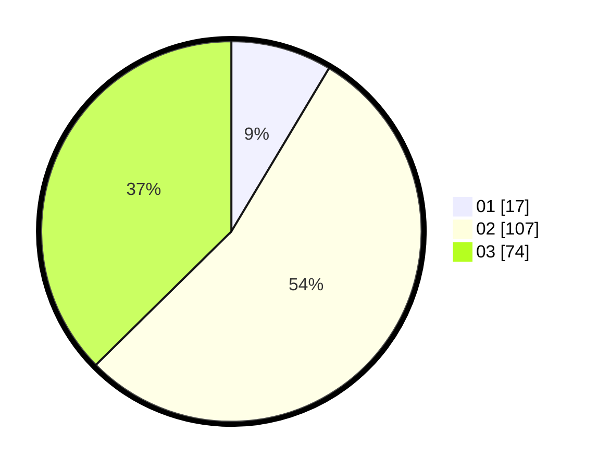

# Hasil

Hasil perolehan suara paslon dapat dilihat pada file paslon-01.txt, paslon-02.txt, dan paslon-03.txt.

Jika tidak ada, artinya data tersebut belum ada pada SIREKAP.

## Perolehan Suara

 * Paslon 01: **17**.
 * Paslon 02: **107**.
 * Paslon 03: **74**.

## Foto C Plano

https://sirekap-obj-formc.kpu.go.id/69cd/pemilu/ppwp/31/73/02/10/06/3173021006113-20240214-175601--d1d8e1a0-0788-464f-bda0-7f3b884a8ac1.jpg

https://sirekap-obj-formc.kpu.go.id/69cd/pemilu/ppwp/31/73/02/10/06/3173021006113-20240214-175442--028bad7c-6958-4695-b433-0d4478c94846.jpg
