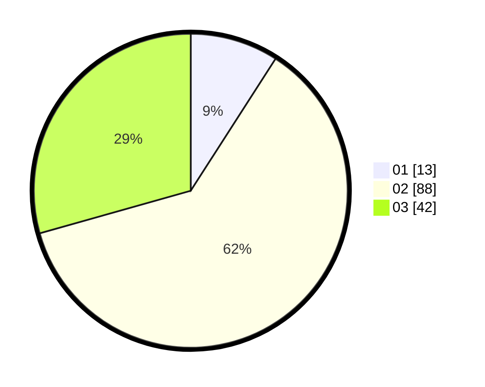

# Hasil

Hasil perolehan suara paslon dapat dilihat pada file paslon-01.txt, paslon-02.txt, dan paslon-03.txt.

Jika tidak ada, artinya data tersebut belum ada pada SIREKAP.

## Perolehan Suara

 * Paslon 01: **13**.
 * Paslon 02: **88**.
 * Paslon 03: **42**.

## Foto C Plano

https://sirekap-obj-formc.kpu.go.id/7550/pemilu/ppwp/31/73/02/10/06/3173021006121-20240214-223919--4c50cff1-bf70-4523-a903-b6825cee2922.jpg

https://sirekap-obj-formc.kpu.go.id/7550/pemilu/ppwp/31/73/02/10/06/3173021006121-20240214-224017--ad7dc3bd-c389-4f4e-a4b4-cd2cf1ddf379.jpg

https://sirekap-obj-formc.kpu.go.id/7550/pemilu/ppwp/31/73/02/10/06/3173021006121-20240214-224156--489c74d4-2e18-4b6c-8f25-3b91262500e4.jpg
