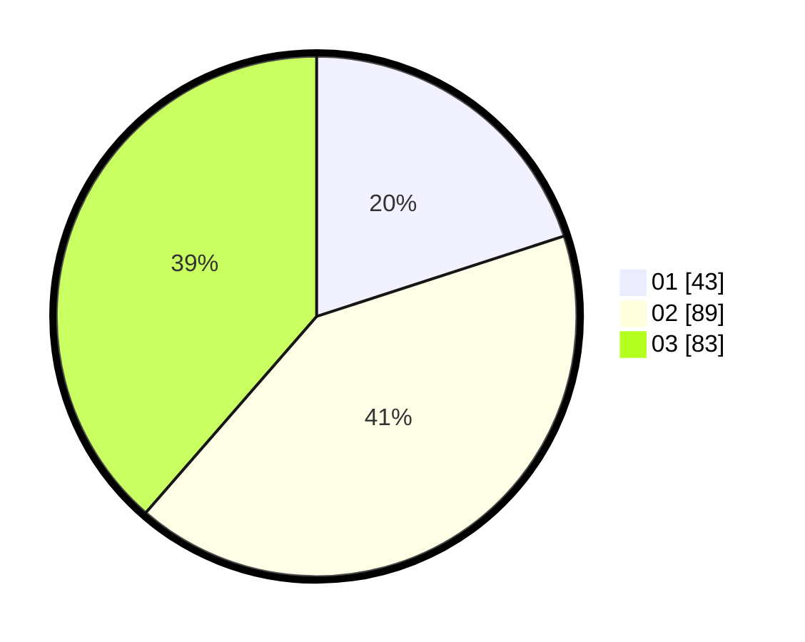

# Hasil

Hasil perolehan suara paslon dapat dilihat pada file paslon-01.txt, paslon-02.txt, dan paslon-03.txt.

Jika tidak ada, artinya data tersebut belum ada pada SIREKAP.

## Perolehan Suara

 * Paslon 01: **43**.
 * Paslon 02: **89**.
 * Paslon 03: **83**.

## Foto C Plano

https://sirekap-obj-formc.kpu.go.id/8d76/pemilu/ppwp/31/73/02/10/06/3173021006128-20240216-145739--76b3095a-14db-4320-b847-a4772754d10c.jpg

https://sirekap-obj-formc.kpu.go.id/8d76/pemilu/ppwp/31/73/02/10/06/3173021006128-20240216-145740--0f1145b1-f862-46c1-a0d8-907e110389ba.jpg

https://sirekap-obj-formc.kpu.go.id/8d76/pemilu/ppwp/31/73/02/10/06/3173021006128-20240216-145740--c9f763de-cd51-4999-a9a8-74c2aed2325e.jpg

## DATA PEMILIH TETAP

Jumlah pemilih dalam DPT: **282**.
 * L: **139**.
 * P: **143**.

## DATA PENGGUNA HAK PILIH

Jumlah pengguna hak pilih dalam DPT: **215**.
 * L: **105**.
 * P: **110**.

Jumlah pengguna hak pilih dalam DPTb: **0**.
 * L: **0**.
 * P: **0**.

Jumlah pengguna hak pilih dalam DPK: **3**.
 * L: **1**.
 * P: **2**.

Jumlah pengguna hak pilih: **0**.
 * L: **0**.
 * P: **0**.

## JUMLAH SUARA SAH DAN TIDAK SAH

JUMLAH SELURUH SUARA SAH: **215**.

JUMLAH SUARA TIDAK SAH: **3**.

JUMLAH SELURUH SUARA SAH DAN SUARA TIDAK SAH: **218**.
