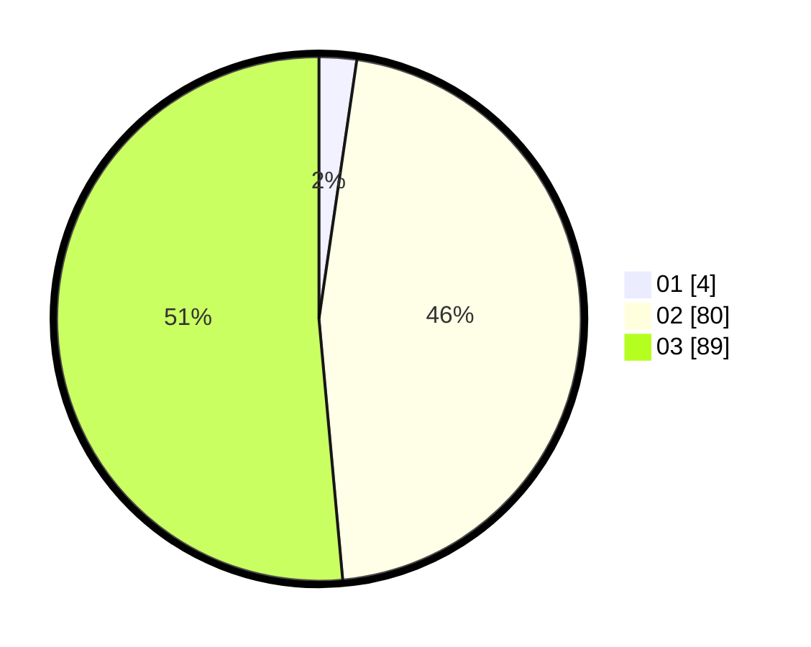

# Hasil

Hasil perolehan suara paslon dapat dilihat pada file paslon-01.txt, paslon-02.txt, dan paslon-03.txt.

Jika tidak ada, artinya data tersebut belum ada pada SIREKAP.

## Perolehan Suara

 * Paslon 01: **4**.
 * Paslon 02: **80**.
 * Paslon 03: **89**.

## Foto C Plano

https://sirekap-obj-formc.kpu.go.id/f7cc/pemilu/ppwp/31/73/02/10/06/3173021006129-20240214-194831--d5ee6da7-a942-4df6-a997-4df6558f5ec9.jpg

https://sirekap-obj-formc.kpu.go.id/f7cc/pemilu/ppwp/31/73/02/10/06/3173021006129-20240214-194839--752d0207-6b01-42e6-a691-a4da5af2e43a.jpg

https://sirekap-obj-formc.kpu.go.id/f7cc/pemilu/ppwp/31/73/02/10/06/3173021006129-20240214-194842--e0dc1211-7b63-4ad2-a4a3-82a39ed01c23.jpg

## DATA PEMILIH TETAP

Jumlah pemilih dalam DPT: **212**.
 * L: **93**.
 * P: **119**.

## DATA PENGGUNA HAK PILIH

Jumlah pengguna hak pilih dalam DPT: **160**.
 * L: **70**.
 * P: **90**.

Jumlah pengguna hak pilih dalam DPTb: **9**.
 * L: **2**.
 * P: **7**.

Jumlah pengguna hak pilih dalam DPK: **4**.
 * L: **1**.
 * P: **3**.

Jumlah pengguna hak pilih: **173**.
 * L: **73**.
 * P: **100**.

## JUMLAH SUARA SAH DAN TIDAK SAH

JUMLAH SELURUH SUARA SAH: **173**.

JUMLAH SUARA TIDAK SAH: **0**.

JUMLAH SELURUH SUARA SAH DAN SUARA TIDAK SAH: **173**.
