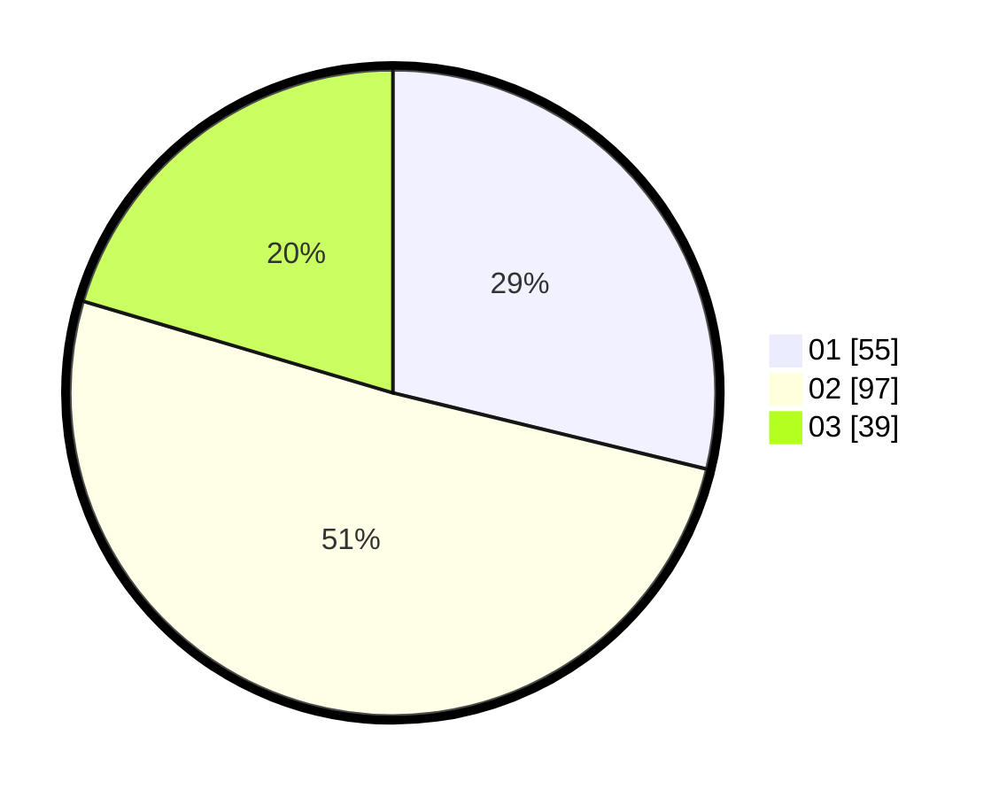

# Hasil

Hasil perolehan suara paslon dapat dilihat pada file paslon-01.txt, paslon-02.txt, dan paslon-03.txt.

Jika tidak ada, artinya data tersebut belum ada pada SIREKAP.

## Perolehan Suara

 * Paslon 01: **55**.
 * Paslon 02: **97**.
 * Paslon 03: **39**.

## Foto C Plano

https://sirekap-obj-formc.kpu.go.id/3b20/pemilu/ppwp/31/73/02/10/07/3173021007001-20240215-002529--a179b687-52a0-4f2b-9eb0-d71f3a099ab5.jpg

https://sirekap-obj-formc.kpu.go.id/3b20/pemilu/ppwp/31/73/02/10/07/3173021007001-20240215-002656--b49e13bc-538a-4a99-a653-7ebeaae9ccaa.jpg

https://sirekap-obj-formc.kpu.go.id/3b20/pemilu/ppwp/31/73/02/10/07/3173021007001-20240215-003911--273c48ce-8bfa-4f9e-87fe-00b89cd89f72.jpg

## DATA PEMILIH TETAP

Jumlah pemilih dalam DPT: **263**.
 * L: **134**.
 * P: **129**.

## DATA PENGGUNA HAK PILIH

Jumlah pengguna hak pilih dalam DPT: **195**.
 * L: **97**.
 * P: **98**.

Jumlah pengguna hak pilih dalam DPTb: **4**.
 * L: **1**.
 * P: **3**.

Jumlah pengguna hak pilih dalam DPK: **0**.
 * L: **0**.
 * P: **0**.

Jumlah pengguna hak pilih: **199**.
 * L: **98**.
 * P: **101**.

## JUMLAH SUARA SAH DAN TIDAK SAH

JUMLAH SELURUH SUARA SAH: **191**.

JUMLAH SUARA TIDAK SAH: **8**.

JUMLAH SELURUH SUARA SAH DAN SUARA TIDAK SAH: **199**.
