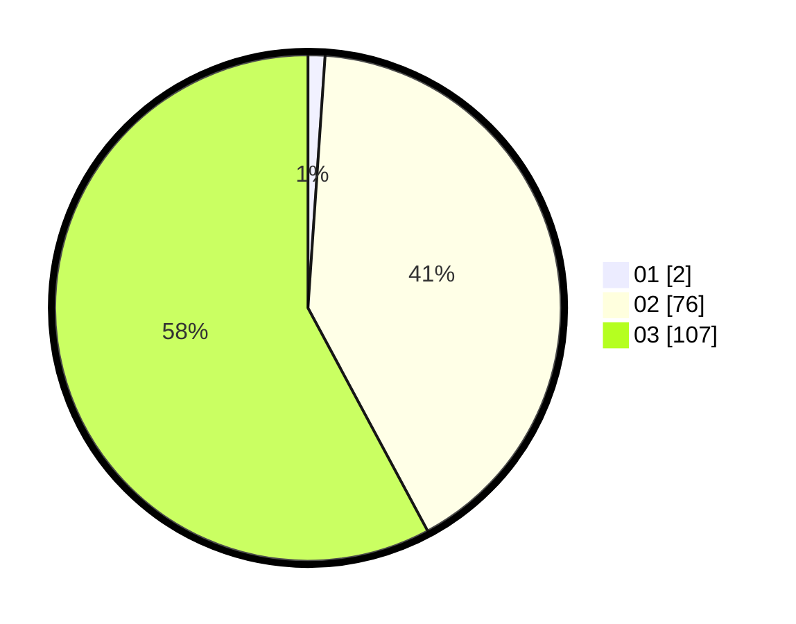

# Hasil

Hasil perolehan suara paslon dapat dilihat pada file paslon-01.txt, paslon-02.txt, dan paslon-03.txt.

Jika tidak ada, artinya data tersebut belum ada pada SIREKAP.

## Perolehan Suara

 * Paslon 01: **2**.
 * Paslon 02: **76**.
 * Paslon 03: **107**.

## Foto C Plano

https://sirekap-obj-formc.kpu.go.id/fe46/pemilu/ppwp/31/73/02/10/07/3173021007004-20240215-215652--c3b89fe3-d8f6-48d4-a7c8-bdaabd8ba31b.jpg

https://sirekap-obj-formc.kpu.go.id/fe46/pemilu/ppwp/31/73/02/10/07/3173021007004-20240215-215654--4746c63a-0f60-4705-abbf-3b46567964d5.jpg

https://sirekap-obj-formc.kpu.go.id/fe46/pemilu/ppwp/31/73/02/10/07/3173021007004-20240215-215652--c152a56d-cfcd-4a85-99ca-2dd0060952cf.jpg

## DATA PEMILIH TETAP

Jumlah pemilih dalam DPT: **242**.
 * L: **108**.
 * P: **134**.

## DATA PENGGUNA HAK PILIH

Jumlah pengguna hak pilih dalam DPT: **181**.
 * L: **83**.
 * P: **98**.

Jumlah pengguna hak pilih dalam DPTb: **2**.
 * L: **1**.
 * P: **1**.

Jumlah pengguna hak pilih dalam DPK: **4**.
 * L: **3**.
 * P: **1**.

Jumlah pengguna hak pilih: **187**.
 * L: **87**.
 * P: **100**.

## JUMLAH SUARA SAH DAN TIDAK SAH

JUMLAH SELURUH SUARA SAH: **185**.

JUMLAH SUARA TIDAK SAH: **2**.

JUMLAH SELURUH SUARA SAH DAN SUARA TIDAK SAH: **187**.
