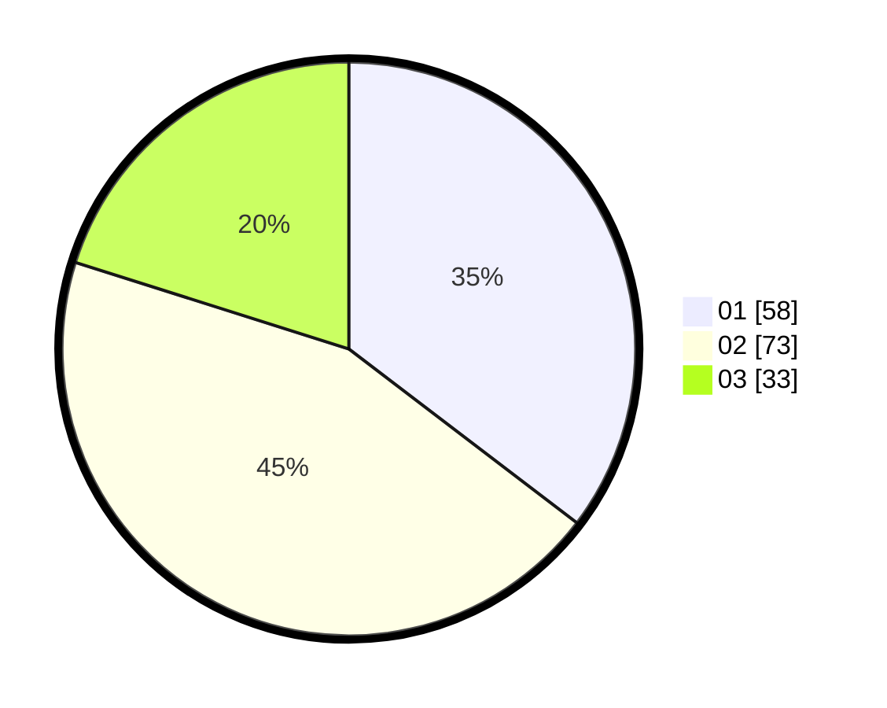

# Hasil

Hasil perolehan suara paslon dapat dilihat pada file paslon-01.txt, paslon-02.txt, dan paslon-03.txt.

Jika tidak ada, artinya data tersebut belum ada pada SIREKAP.

## Perolehan Suara

 * Paslon 01: **58**.
 * Paslon 02: **73**.
 * Paslon 03: **33**.

## Foto C Plano

https://sirekap-obj-formc.kpu.go.id/0d09/pemilu/ppwp/31/73/02/10/07/3173021007008-20240216-005415--661c59b3-b874-4a8f-a7d0-1686f64df7e7.jpg

https://sirekap-obj-formc.kpu.go.id/0d09/pemilu/ppwp/31/73/02/10/07/3173021007008-20240216-005423--93a2def0-5e51-4de2-887d-cf44452f821c.jpg

https://sirekap-obj-formc.kpu.go.id/0d09/pemilu/ppwp/31/73/02/10/07/3173021007008-20240216-005421--e51597cb-5885-4703-a567-342e5444263b.jpg

## DATA PEMILIH TETAP

Jumlah pemilih dalam DPT: **258**.
 * L: **121**.
 * P: **137**.

## DATA PENGGUNA HAK PILIH

Jumlah pengguna hak pilih dalam DPT: **165**.
 * L: **74**.
 * P: **91**.

Jumlah pengguna hak pilih dalam DPTb: **2**.
 * L: **1**.
 * P: **1**.

Jumlah pengguna hak pilih dalam DPK: **0**.
 * L: **0**.
 * P: **0**.

Jumlah pengguna hak pilih: **167**.
 * L: **75**.
 * P: **92**.

## JUMLAH SUARA SAH DAN TIDAK SAH

JUMLAH SELURUH SUARA SAH: **164**.

JUMLAH SUARA TIDAK SAH: **3**.

JUMLAH SELURUH SUARA SAH DAN SUARA TIDAK SAH: **167**.
