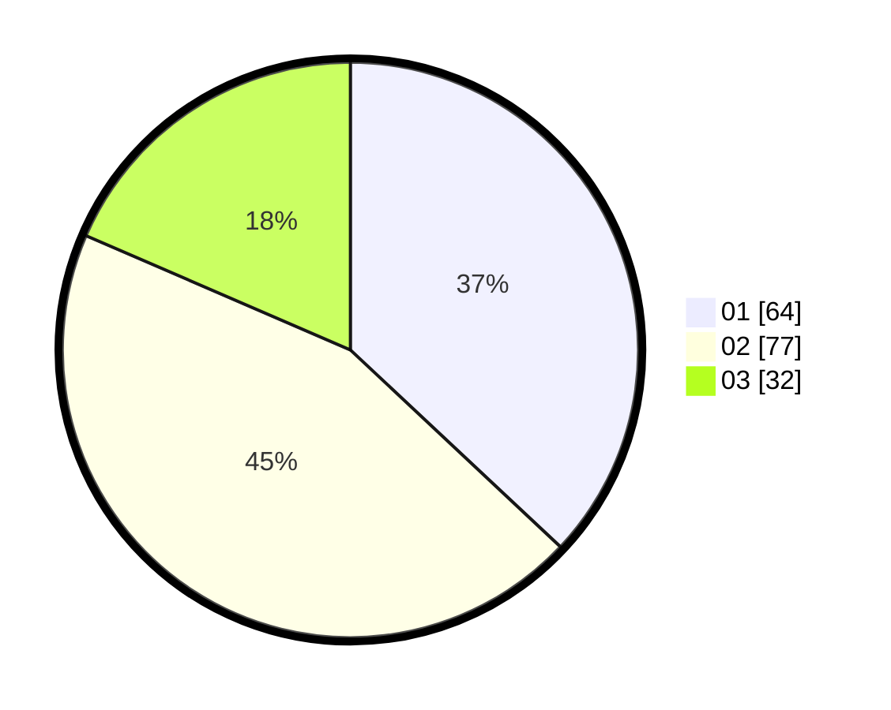

# Hasil

Hasil perolehan suara paslon dapat dilihat pada file paslon-01.txt, paslon-02.txt, dan paslon-03.txt.

Jika tidak ada, artinya data tersebut belum ada pada SIREKAP.

## Perolehan Suara

 * Paslon 01: **64**.
 * Paslon 02: **77**.
 * Paslon 03: **32**.

## Foto C Plano

https://sirekap-obj-formc.kpu.go.id/6d51/pemilu/ppwp/31/73/02/10/07/3173021007009-20240214-162221--a0aa56b4-62d0-43e7-9f8b-9623cd222106.jpg

https://sirekap-obj-formc.kpu.go.id/6d51/pemilu/ppwp/31/73/02/10/07/3173021007009-20240214-192102--ac20d530-57da-420c-a134-5d7b5e5189cf.jpg

https://sirekap-obj-formc.kpu.go.id/6d51/pemilu/ppwp/31/73/02/10/07/3173021007009-20240214-192126--4ff1dc1f-cdb6-449e-94f6-00669555d0b2.jpg

## DATA PEMILIH TETAP

Jumlah pemilih dalam DPT: **218**.
 * L: **109**.
 * P: **109**.

## DATA PENGGUNA HAK PILIH

Jumlah pengguna hak pilih dalam DPT: **171**.
 * L: **86**.
 * P: **85**.

Jumlah pengguna hak pilih dalam DPTb: **4**.
 * L: **1**.
 * P: **3**.

Jumlah pengguna hak pilih dalam DPK: **1**.
 * L: **1**.
 * P: **0**.

Jumlah pengguna hak pilih: **176**.
 * L: **88**.
 * P: **88**.

## JUMLAH SUARA SAH DAN TIDAK SAH

JUMLAH SELURUH SUARA SAH: **173**.

JUMLAH SUARA TIDAK SAH: **3**.

JUMLAH SELURUH SUARA SAH DAN SUARA TIDAK SAH: **176**.
