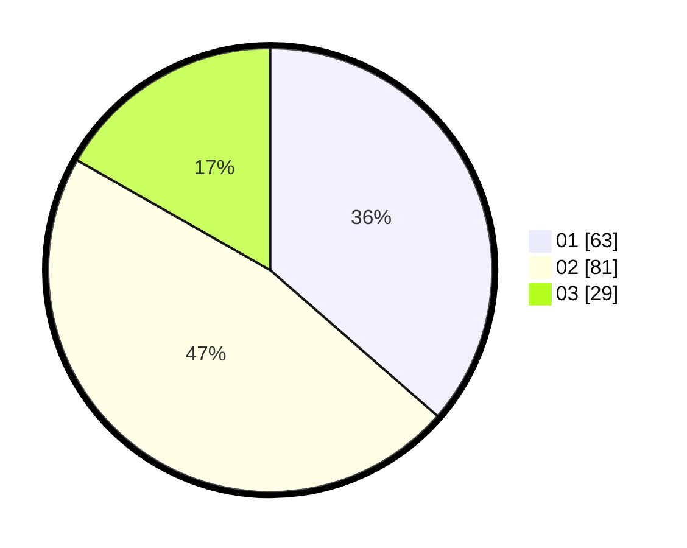

# Hasil

Hasil perolehan suara paslon dapat dilihat pada file paslon-01.txt, paslon-02.txt, dan paslon-03.txt.

Jika tidak ada, artinya data tersebut belum ada pada SIREKAP.

## Perolehan Suara

 * Paslon 01: **63**.
 * Paslon 02: **81**.
 * Paslon 03: **29**.

## Foto C Plano

https://sirekap-obj-formc.kpu.go.id/bc5d/pemilu/ppwp/31/73/02/10/07/3173021007010-20240214-215159--c59864dd-ba17-4af5-aeee-59db54143b6c.jpg

https://sirekap-obj-formc.kpu.go.id/bc5d/pemilu/ppwp/31/73/02/10/07/3173021007010-20240214-215449--4d96dcb3-f548-4b6f-9d1a-f1b9f70aaed2.jpg

https://sirekap-obj-formc.kpu.go.id/bc5d/pemilu/ppwp/31/73/02/10/07/3173021007010-20240214-215416--1e390631-30e9-4f85-94c3-cb718685062b.jpg

## DATA PEMILIH TETAP

Jumlah pemilih dalam DPT: **265**.
 * L: **141**.
 * P: **124**.

## DATA PENGGUNA HAK PILIH

Jumlah pengguna hak pilih dalam DPT: **175**.
 * L: **90**.
 * P: **85**.

Jumlah pengguna hak pilih dalam DPTb: **0**.
 * L: **0**.
 * P: **0**.

Jumlah pengguna hak pilih dalam DPK: **1**.
 * L: **1**.
 * P: **0**.

Jumlah pengguna hak pilih: **176**.
 * L: **91**.
 * P: **85**.

## JUMLAH SUARA SAH DAN TIDAK SAH

JUMLAH SELURUH SUARA SAH: **173**.

JUMLAH SUARA TIDAK SAH: **5**.

JUMLAH SELURUH SUARA SAH DAN SUARA TIDAK SAH: **178**.
