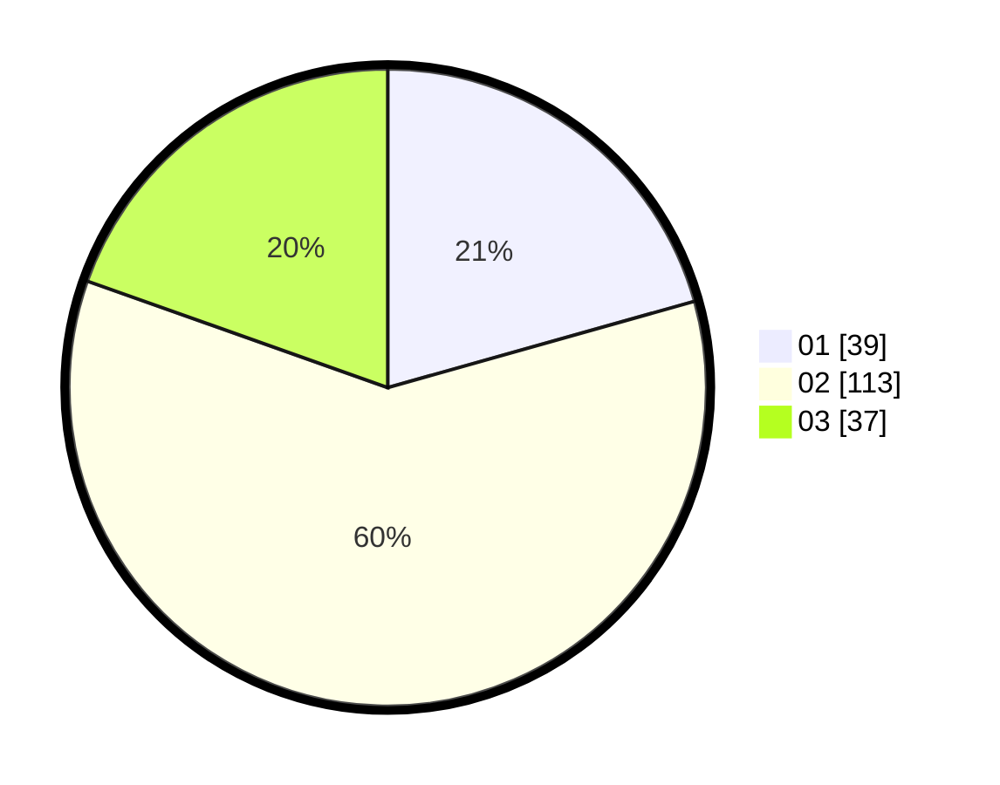

# Hasil

Hasil perolehan suara paslon dapat dilihat pada file paslon-01.txt, paslon-02.txt, dan paslon-03.txt.

Jika tidak ada, artinya data tersebut belum ada pada SIREKAP.

## Perolehan Suara

 * Paslon 01: **39**.
 * Paslon 02: **113**.
 * Paslon 03: **37**.

## Foto C Plano

https://sirekap-obj-formc.kpu.go.id/cca8/pemilu/ppwp/31/73/02/10/07/3173021007011-20240216-142722--c30896ab-f91d-4003-a61d-766c3cd450d0.jpg

https://sirekap-obj-formc.kpu.go.id/cca8/pemilu/ppwp/31/73/02/10/07/3173021007011-20240214-224314--1f8e38a8-1b54-4e75-80ba-3f7696e2ef80.jpg

https://sirekap-obj-formc.kpu.go.id/cca8/pemilu/ppwp/31/73/02/10/07/3173021007011-20240214-224415--44738783-b464-4706-a6c6-e7ecd457af34.jpg

## DATA PEMILIH TETAP

Jumlah pemilih dalam DPT: **260**.
 * L: **133**.
 * P: **127**.

## DATA PENGGUNA HAK PILIH

Jumlah pengguna hak pilih dalam DPT: **192**.
 * L: **94**.
 * P: **98**.

Jumlah pengguna hak pilih dalam DPTb: **0**.
 * L: **0**.
 * P: **0**.

Jumlah pengguna hak pilih dalam DPK: **1**.
 * L: **1**.
 * P: **0**.

Jumlah pengguna hak pilih: **193**.
 * L: **95**.
 * P: **98**.

## JUMLAH SUARA SAH DAN TIDAK SAH

JUMLAH SELURUH SUARA SAH: **189**.

JUMLAH SUARA TIDAK SAH: **4**.

JUMLAH SELURUH SUARA SAH DAN SUARA TIDAK SAH: **193**.
