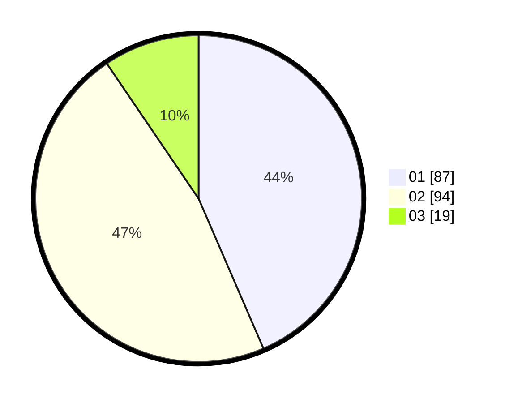

# Hasil

Hasil perolehan suara paslon dapat dilihat pada file paslon-01.txt, paslon-02.txt, dan paslon-03.txt.

Jika tidak ada, artinya data tersebut belum ada pada SIREKAP.

## Perolehan Suara

 * Paslon 01: **87**.
 * Paslon 02: **94**.
 * Paslon 03: **19**.

## Foto C Plano

https://sirekap-obj-formc.kpu.go.id/c55d/pemilu/ppwp/31/73/02/10/07/3173021007015-20240215-002121--3a4d6656-c6da-4de0-b42d-39af4b068b7d.jpg

https://sirekap-obj-formc.kpu.go.id/c55d/pemilu/ppwp/31/73/02/10/07/3173021007015-20240215-002838--2c158cd5-b023-4646-b9c7-80758c6d5e53.jpg

https://sirekap-obj-formc.kpu.go.id/c55d/pemilu/ppwp/31/73/02/10/07/3173021007015-20240215-002921--13b360fe-d433-4ca6-8a74-3b3257fda8a2.jpg
