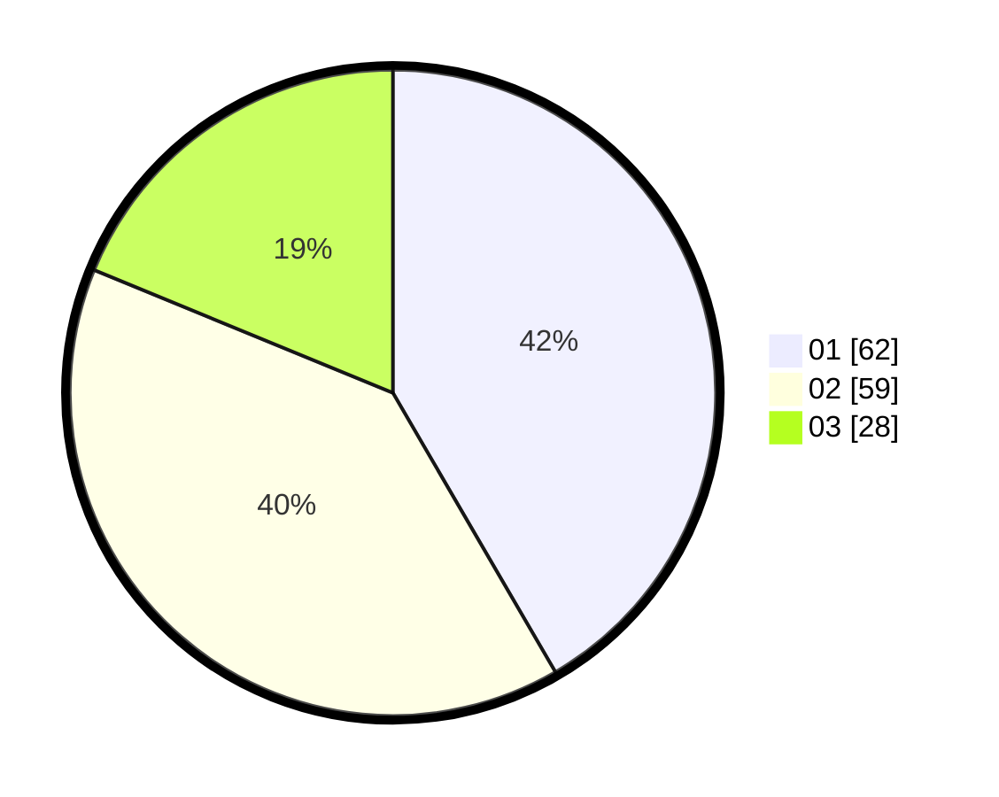

# Hasil

Hasil perolehan suara paslon dapat dilihat pada file paslon-01.txt, paslon-02.txt, dan paslon-03.txt.

Jika tidak ada, artinya data tersebut belum ada pada SIREKAP.

## Perolehan Suara

 * Paslon 01: **62**.
 * Paslon 02: **59**.
 * Paslon 03: **28**.

## Foto C Plano

https://sirekap-obj-formc.kpu.go.id/b66c/pemilu/ppwp/31/73/02/10/07/3173021007022-20240216-042101--a701616c-95c7-4e8c-8622-3ea5ad8165bf.jpg

https://sirekap-obj-formc.kpu.go.id/b66c/pemilu/ppwp/31/73/02/10/07/3173021007022-20240216-042111--ee3d7a29-d386-4a9a-81a2-32656df0ebd8.jpg

https://sirekap-obj-formc.kpu.go.id/b66c/pemilu/ppwp/31/73/02/10/07/3173021007022-20240216-042102--7f96390e-6082-44d7-aafb-692c09931e9d.jpg

## DATA PEMILIH TETAP

Jumlah pemilih dalam DPT: **275**.
 * L: **155**.
 * P: **120**.

## DATA PENGGUNA HAK PILIH

Jumlah pengguna hak pilih dalam DPT: **126**.
 * L: **63**.
 * P: **63**.

Jumlah pengguna hak pilih dalam DPTb: **26**.
 * L: **12**.
 * P: **14**.

Jumlah pengguna hak pilih dalam DPK: **0**.
 * L: **0**.
 * P: **0**.

Jumlah pengguna hak pilih: **152**.
 * L: **75**.
 * P: **77**.

## JUMLAH SUARA SAH DAN TIDAK SAH

JUMLAH SELURUH SUARA SAH: **149**.

JUMLAH SUARA TIDAK SAH: **3**.

JUMLAH SELURUH SUARA SAH DAN SUARA TIDAK SAH: **152**.
