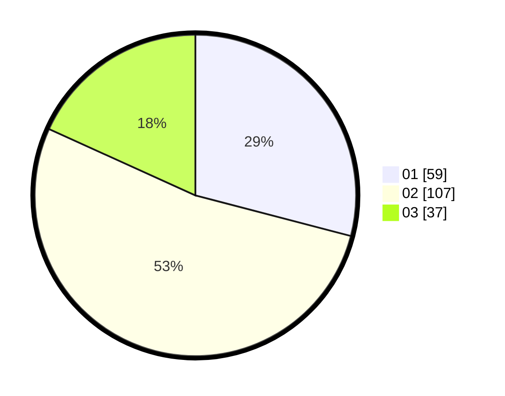

# Hasil

Hasil perolehan suara paslon dapat dilihat pada file paslon-01.txt, paslon-02.txt, dan paslon-03.txt.

Jika tidak ada, artinya data tersebut belum ada pada SIREKAP.

## Perolehan Suara

 * Paslon 01: **59**.
 * Paslon 02: **107**.
 * Paslon 03: **37**.

## Foto C Plano

https://sirekap-obj-formc.kpu.go.id/abf0/pemilu/ppwp/31/73/02/10/07/3173021007023-20240214-220749--001b153f-ea98-48ca-8331-5380eca8ac1c.jpg

https://sirekap-obj-formc.kpu.go.id/abf0/pemilu/ppwp/31/73/02/10/07/3173021007023-20240214-220844--ca9ad35e-5681-4061-bdb5-0179215c5426.jpg

https://sirekap-obj-formc.kpu.go.id/abf0/pemilu/ppwp/31/73/02/10/07/3173021007023-20240214-220938--5cb9fa1a-cb18-447c-823b-578be765ade8.jpg

## DATA PEMILIH TETAP

Jumlah pemilih dalam DPT: **273**.
 * L: **137**.
 * P: **136**.

## DATA PENGGUNA HAK PILIH

Jumlah pengguna hak pilih dalam DPT: **205**.
 * L: **97**.
 * P: **108**.

Jumlah pengguna hak pilih dalam DPTb: **0**.
 * L: **0**.
 * P: **0**.

Jumlah pengguna hak pilih dalam DPK: **0**.
 * L: **0**.
 * P: **0**.

Jumlah pengguna hak pilih: **205**.
 * L: **97**.
 * P: **108**.

## JUMLAH SUARA SAH DAN TIDAK SAH

JUMLAH SELURUH SUARA SAH: **203**.

JUMLAH SUARA TIDAK SAH: **2**.

JUMLAH SELURUH SUARA SAH DAN SUARA TIDAK SAH: **205**.
