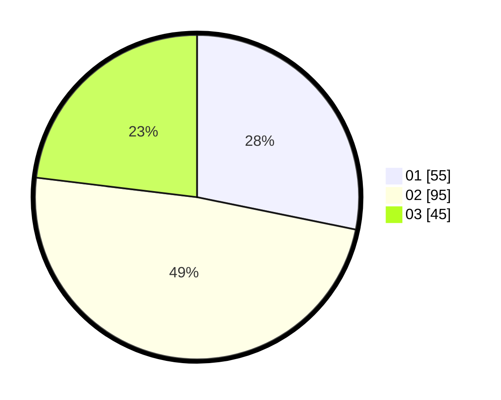

# Hasil

Hasil perolehan suara paslon dapat dilihat pada file paslon-01.txt, paslon-02.txt, dan paslon-03.txt.

Jika tidak ada, artinya data tersebut belum ada pada SIREKAP.

## Perolehan Suara

 * Paslon 01: **55**.
 * Paslon 02: **95**.
 * Paslon 03: **45**.

## Foto C Plano

https://sirekap-obj-formc.kpu.go.id/b5fc/pemilu/ppwp/31/73/02/10/07/3173021007031-20240214-212003--9045b8aa-abf3-49a4-a937-fd4860052989.jpg

https://sirekap-obj-formc.kpu.go.id/b5fc/pemilu/ppwp/31/73/02/10/07/3173021007031-20240214-212122--80e12e07-b180-4ae5-90ef-5b31db1e0b95.jpg

https://sirekap-obj-formc.kpu.go.id/b5fc/pemilu/ppwp/31/73/02/10/07/3173021007031-20240214-223222--2b1df4c4-a9f0-4a37-bfd7-79709c4e758e.jpg
