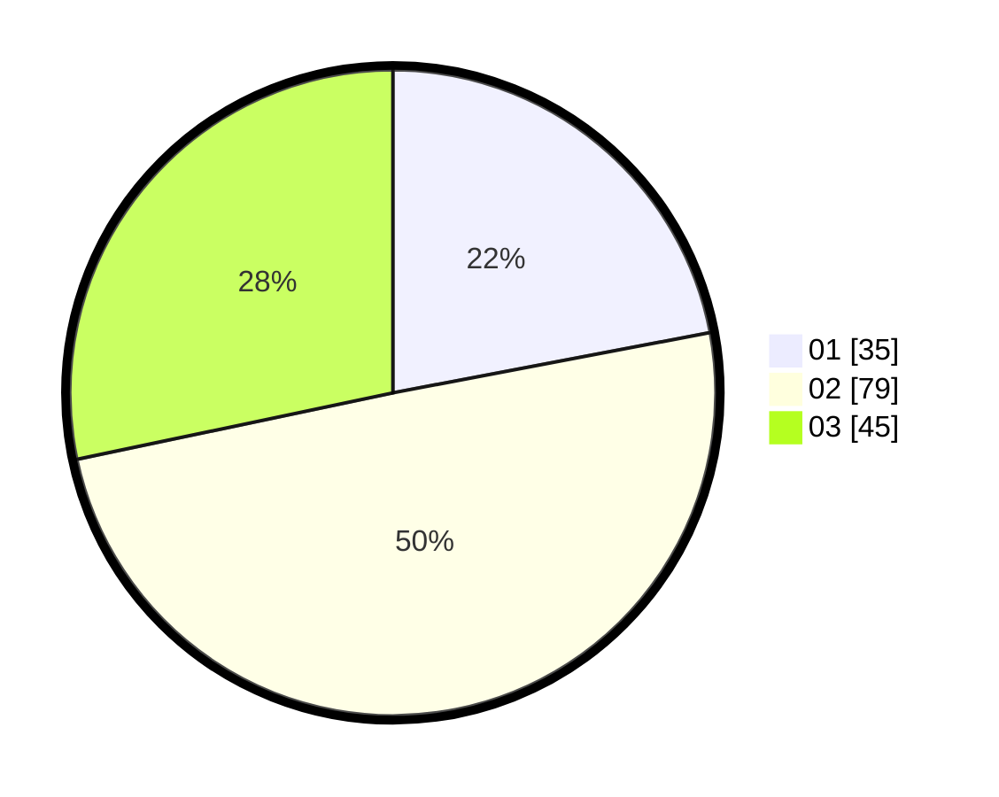

# Hasil

Hasil perolehan suara paslon dapat dilihat pada file paslon-01.txt, paslon-02.txt, dan paslon-03.txt.

Jika tidak ada, artinya data tersebut belum ada pada SIREKAP.

## Perolehan Suara

 * Paslon 01: **35**.
 * Paslon 02: **79**.
 * Paslon 03: **45**.

## Foto C Plano

https://sirekap-obj-formc.kpu.go.id/6501/pemilu/ppwp/31/73/02/10/07/3173021007034-20240214-233839--d13ca986-39e5-4bef-802f-c60e60c94aaa.jpg

https://sirekap-obj-formc.kpu.go.id/6501/pemilu/ppwp/31/73/02/10/07/3173021007034-20240214-231331--378d82a8-2de1-42bd-aa7f-69408780f538.jpg

https://sirekap-obj-formc.kpu.go.id/6501/pemilu/ppwp/31/73/02/10/07/3173021007034-20240214-231833--81796c08-41aa-4f57-95c4-6cc7a4734af2.jpg

## DATA PEMILIH TETAP

Jumlah pemilih dalam DPT: **277**.
 * L: **144**.
 * P: **133**.

## DATA PENGGUNA HAK PILIH

Jumlah pengguna hak pilih dalam DPT: **158**.
 * L: **75**.
 * P: **83**.

Jumlah pengguna hak pilih dalam DPTb: **0**.
 * L: **0**.
 * P: **0**.

Jumlah pengguna hak pilih dalam DPK: **2**.
 * L: **1**.
 * P: **1**.

Jumlah pengguna hak pilih: **160**.
 * L: **76**.
 * P: **84**.

## JUMLAH SUARA SAH DAN TIDAK SAH

JUMLAH SELURUH SUARA SAH: **159**.

JUMLAH SUARA TIDAK SAH: **1**.

JUMLAH SELURUH SUARA SAH DAN SUARA TIDAK SAH: **160**.
