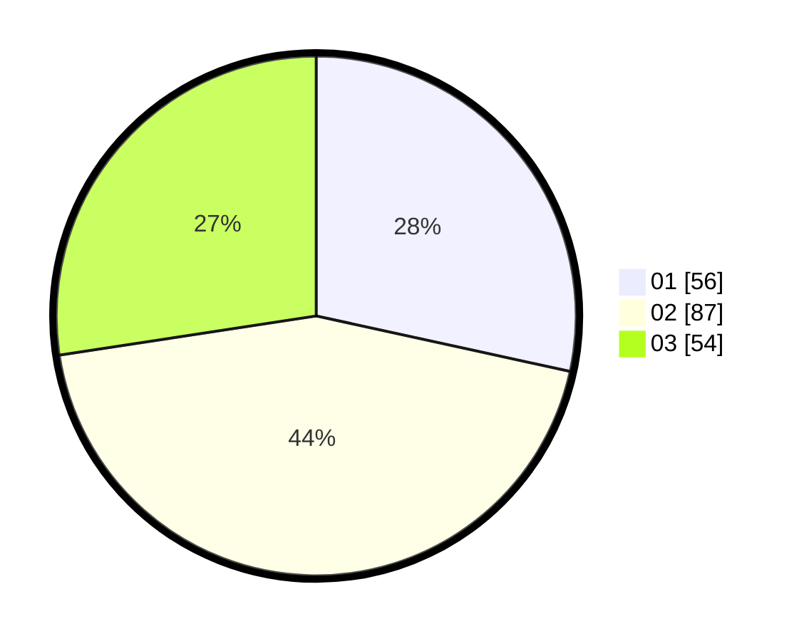

# Hasil

Hasil perolehan suara paslon dapat dilihat pada file paslon-01.txt, paslon-02.txt, dan paslon-03.txt.

Jika tidak ada, artinya data tersebut belum ada pada SIREKAP.

## Perolehan Suara

 * Paslon 01: **56**.
 * Paslon 02: **87**.
 * Paslon 03: **54**.

## Foto C Plano

https://sirekap-obj-formc.kpu.go.id/cfb3/pemilu/ppwp/31/73/02/10/07/3173021007035-20240217-003903--efcf6058-a1f1-4575-b0b3-424aaf831ab1.jpg

https://sirekap-obj-formc.kpu.go.id/cfb3/pemilu/ppwp/31/73/02/10/07/3173021007035-20240217-003904--9899e631-fda8-4201-bf8f-8864cbe9b2a8.jpg

https://sirekap-obj-formc.kpu.go.id/cfb3/pemilu/ppwp/31/73/02/10/07/3173021007035-20240217-003904--dbcd1cb8-bb8e-4da4-8296-951306474e88.jpg

## DATA PEMILIH TETAP

Jumlah pemilih dalam DPT: **282**.
 * L: **132**.
 * P: **150**.

## DATA PENGGUNA HAK PILIH

Jumlah pengguna hak pilih dalam DPT: **197**.
 * L: **93**.
 * P: **104**.

Jumlah pengguna hak pilih dalam DPTb: **0**.
 * L: **0**.
 * P: **0**.

Jumlah pengguna hak pilih dalam DPK: **6**.
 * L: **3**.
 * P: **3**.

Jumlah pengguna hak pilih: **203**.
 * L: **96**.
 * P: **107**.

## JUMLAH SUARA SAH DAN TIDAK SAH

JUMLAH SELURUH SUARA SAH: **197**.

JUMLAH SUARA TIDAK SAH: **6**.

JUMLAH SELURUH SUARA SAH DAN SUARA TIDAK SAH: **203**.
