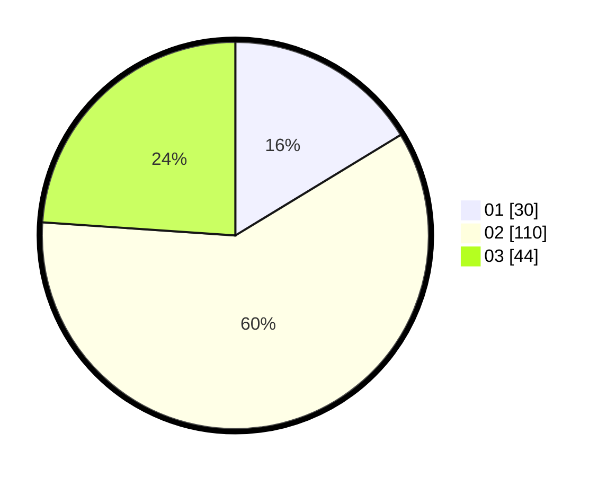

# Hasil

Hasil perolehan suara paslon dapat dilihat pada file paslon-01.txt, paslon-02.txt, dan paslon-03.txt.

Jika tidak ada, artinya data tersebut belum ada pada SIREKAP.

## Perolehan Suara

 * Paslon 01: **30**.
 * Paslon 02: **110**.
 * Paslon 03: **44**.

## Foto C Plano

https://sirekap-obj-formc.kpu.go.id/7dbf/pemilu/ppwp/31/73/02/10/07/3173021007036-20240215-090719--38ad5c0f-192c-4b60-9c76-64a70d837881.jpg

https://sirekap-obj-formc.kpu.go.id/7dbf/pemilu/ppwp/31/73/02/10/07/3173021007036-20240215-090722--2438e91f-de0f-458c-a572-c0f88d59e3b0.jpg

https://sirekap-obj-formc.kpu.go.id/7dbf/pemilu/ppwp/31/73/02/10/07/3173021007036-20240215-090724--e61e69d7-e3d7-448c-a1d5-517c2154aff7.jpg
