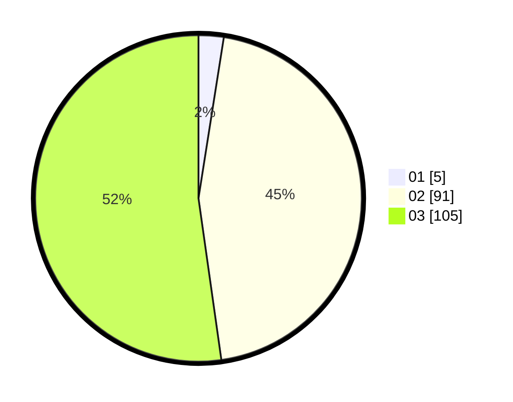

# Hasil

Hasil perolehan suara paslon dapat dilihat pada file paslon-01.txt, paslon-02.txt, dan paslon-03.txt.

Jika tidak ada, artinya data tersebut belum ada pada SIREKAP.

## Perolehan Suara

 * Paslon 01: **5**.
 * Paslon 02: **91**.
 * Paslon 03: **105**.

## Foto C Plano

https://sirekap-obj-formc.kpu.go.id/cd16/pemilu/ppwp/31/73/02/10/07/3173021007038-20240214-223623--70478d3e-6398-4274-b473-e52fc43afd5b.jpg

https://sirekap-obj-formc.kpu.go.id/cd16/pemilu/ppwp/31/73/02/10/07/3173021007038-20240214-211915--23970a84-1b0b-4c94-934f-e90222bb56fb.jpg

https://sirekap-obj-formc.kpu.go.id/cd16/pemilu/ppwp/31/73/02/10/07/3173021007038-20240214-212418--9b0ccb6f-1c84-4536-94e6-7b12539fe89e.jpg

## DATA PEMILIH TETAP

Jumlah pemilih dalam DPT: **274**.
 * L: **127**.
 * P: **147**.

## DATA PENGGUNA HAK PILIH

Jumlah pengguna hak pilih dalam DPT: **203**.
 * L: **95**.
 * P: **108**.

Jumlah pengguna hak pilih dalam DPTb: **0**.
 * L: **0**.
 * P: **0**.

Jumlah pengguna hak pilih dalam DPK: **0**.
 * L: **0**.
 * P: **0**.

Jumlah pengguna hak pilih: **203**.
 * L: **95**.
 * P: **108**.

## JUMLAH SUARA SAH DAN TIDAK SAH

JUMLAH SELURUH SUARA SAH: **201**.

JUMLAH SUARA TIDAK SAH: **2**.

JUMLAH SELURUH SUARA SAH DAN SUARA TIDAK SAH: **203**.
