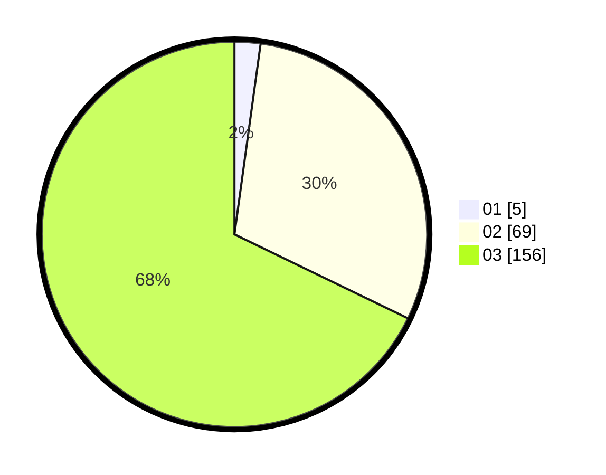

# Hasil

Hasil perolehan suara paslon dapat dilihat pada file paslon-01.txt, paslon-02.txt, dan paslon-03.txt.

Jika tidak ada, artinya data tersebut belum ada pada SIREKAP.

## Perolehan Suara

 * Paslon 01: **5**.
 * Paslon 02: **69**.
 * Paslon 03: **156**.

## Foto C Plano

https://sirekap-obj-formc.kpu.go.id/2e0c/pemilu/ppwp/31/73/02/10/07/3173021007039-20240215-000141--42e9c121-0bb7-4abc-a0d7-9e983e4c6171.jpg

https://sirekap-obj-formc.kpu.go.id/2e0c/pemilu/ppwp/31/73/02/10/07/3173021007039-20240215-000443--7c7bd94e-396b-413c-92f0-fca939032d7c.jpg

https://sirekap-obj-formc.kpu.go.id/2e0c/pemilu/ppwp/31/73/02/10/07/3173021007039-20240215-000605--a8db9012-38c8-4f01-9458-73a8f9db2c8b.jpg
