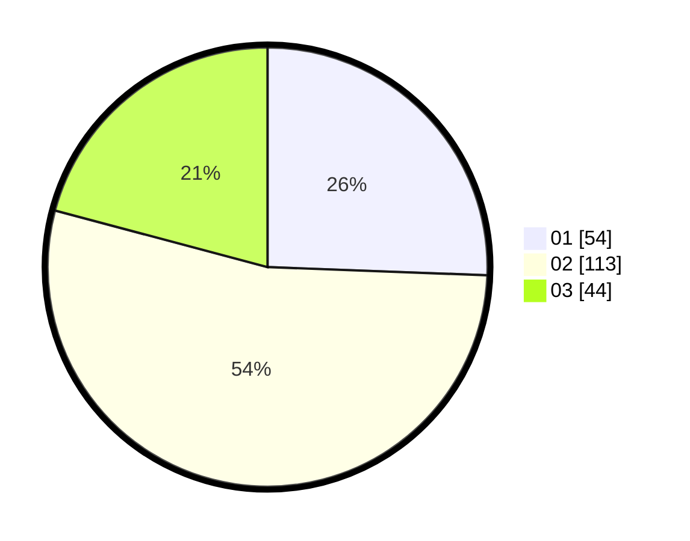

# Hasil

Hasil perolehan suara paslon dapat dilihat pada file paslon-01.txt, paslon-02.txt, dan paslon-03.txt.

Jika tidak ada, artinya data tersebut belum ada pada SIREKAP.

## Perolehan Suara

 * Paslon 01: **54**.
 * Paslon 02: **113**.
 * Paslon 03: **44**.

## Foto C Plano

https://sirekap-obj-formc.kpu.go.id/fd35/pemilu/ppwp/31/73/02/10/07/3173021007040-20240214-155644--c4bc1615-d8b9-430e-a0bf-7a61b3511efe.jpg

https://sirekap-obj-formc.kpu.go.id/fd35/pemilu/ppwp/31/73/02/10/07/3173021007040-20240214-155731--6e044776-e872-4748-8ead-c9b2cca6924d.jpg

https://sirekap-obj-formc.kpu.go.id/fd35/pemilu/ppwp/31/73/02/10/07/3173021007040-20240214-155821--ad77f2e1-950b-46f4-a045-f33131154979.jpg
