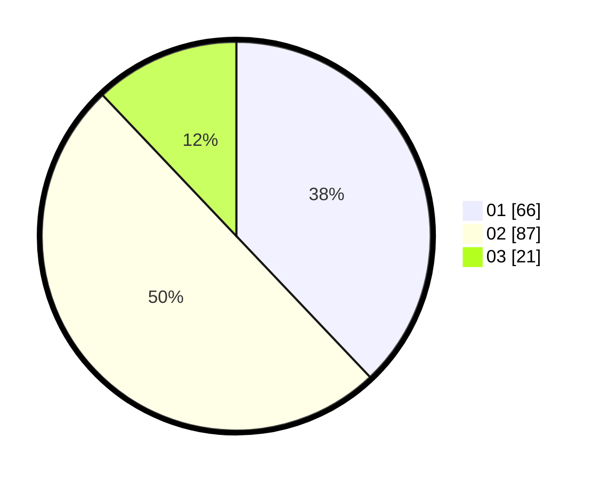

# Hasil

Hasil perolehan suara paslon dapat dilihat pada file paslon-01.txt, paslon-02.txt, dan paslon-03.txt.

Jika tidak ada, artinya data tersebut belum ada pada SIREKAP.

## Perolehan Suara

 * Paslon 01: **66**.
 * Paslon 02: **87**.
 * Paslon 03: **21**.

## Foto C Plano

https://sirekap-obj-formc.kpu.go.id/37ba/pemilu/ppwp/31/73/02/10/07/3173021007043-20240216-121814--50ebba22-352a-4b78-988f-b782c2c7578c.jpg

https://sirekap-obj-formc.kpu.go.id/37ba/pemilu/ppwp/31/73/02/10/07/3173021007043-20240216-121816--e66d0281-5704-4f84-9a25-094193f22649.jpg

https://sirekap-obj-formc.kpu.go.id/37ba/pemilu/ppwp/31/73/02/10/07/3173021007043-20240216-121815--d268f2f8-99ed-4171-88ab-cd1e3304f2e5.jpg

## DATA PEMILIH TETAP

Jumlah pemilih dalam DPT: **235**.
 * L: **122**.
 * P: **113**.

## DATA PENGGUNA HAK PILIH

Jumlah pengguna hak pilih dalam DPT: **170**.
 * L: **83**.
 * P: **87**.

Jumlah pengguna hak pilih dalam DPTb: **2**.
 * L: **0**.
 * P: **2**.

Jumlah pengguna hak pilih dalam DPK: **3**.
 * L: **1**.
 * P: **2**.

Jumlah pengguna hak pilih: **175**.
 * L: **84**.
 * P: **91**.

## JUMLAH SUARA SAH DAN TIDAK SAH

JUMLAH SELURUH SUARA SAH: **174**.

JUMLAH SUARA TIDAK SAH: **1**.

JUMLAH SELURUH SUARA SAH DAN SUARA TIDAK SAH: **175**.
