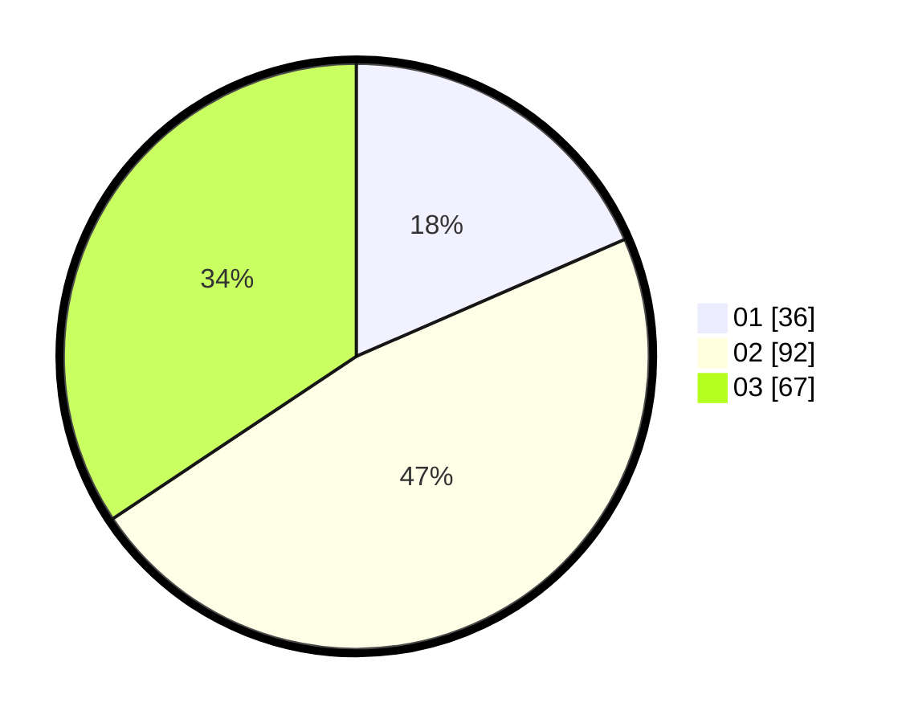

# Hasil

Hasil perolehan suara paslon dapat dilihat pada file paslon-01.txt, paslon-02.txt, dan paslon-03.txt.

Jika tidak ada, artinya data tersebut belum ada pada SIREKAP.

## Perolehan Suara

 * Paslon 01: **36**.
 * Paslon 02: **92**.
 * Paslon 03: **67**.

## Foto C Plano

https://sirekap-obj-formc.kpu.go.id/78d4/pemilu/ppwp/31/73/02/10/07/3173021007048-20240214-213649--eaec05e2-31e5-4e75-99b0-8486400f8c2c.jpg

https://sirekap-obj-formc.kpu.go.id/78d4/pemilu/ppwp/31/73/02/10/07/3173021007048-20240214-213756--391b22ec-819d-47f3-bc1f-7dc466f2bca7.jpg

https://sirekap-obj-formc.kpu.go.id/78d4/pemilu/ppwp/31/73/02/10/07/3173021007048-20240214-213858--0cf42f1d-09ee-42fd-9a0c-e34e999292f3.jpg

## DATA PEMILIH TETAP

Jumlah pemilih dalam DPT: **278**.
 * L: **138**.
 * P: **140**.

## DATA PENGGUNA HAK PILIH

Jumlah pengguna hak pilih dalam DPT: **175**.
 * L: **86**.
 * P: **89**.

Jumlah pengguna hak pilih dalam DPTb: **15**.
 * L: **7**.
 * P: **8**.

Jumlah pengguna hak pilih dalam DPK: **8**.
 * L: **3**.
 * P: **5**.

Jumlah pengguna hak pilih: **198**.
 * L: **96**.
 * P: **102**.

## JUMLAH SUARA SAH DAN TIDAK SAH

JUMLAH SELURUH SUARA SAH: **195**.

JUMLAH SUARA TIDAK SAH: **3**.

JUMLAH SELURUH SUARA SAH DAN SUARA TIDAK SAH: **198**.
