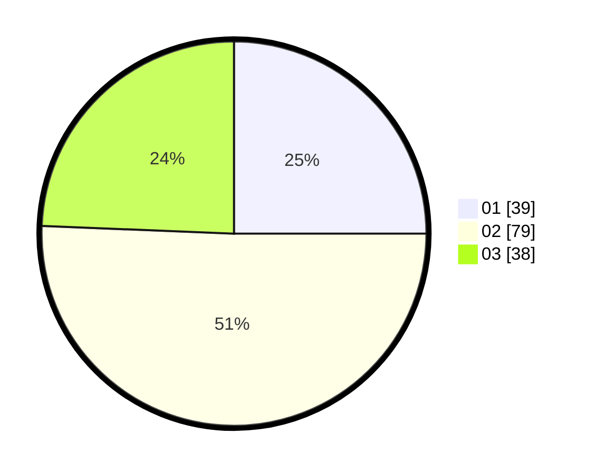

# Hasil

Hasil perolehan suara paslon dapat dilihat pada file paslon-01.txt, paslon-02.txt, dan paslon-03.txt.

Jika tidak ada, artinya data tersebut belum ada pada SIREKAP.

## Perolehan Suara

 * Paslon 01: **39**.
 * Paslon 02: **79**.
 * Paslon 03: **38**.

## Foto C Plano

https://sirekap-obj-formc.kpu.go.id/0c12/pemilu/ppwp/31/73/02/10/07/3173021007050-20240214-205251--b018445e-305b-4903-bdcb-2188a24047bf.jpg

https://sirekap-obj-formc.kpu.go.id/0c12/pemilu/ppwp/31/73/02/10/07/3173021007050-20240214-205257--f13b4428-4969-4703-9222-d7f6a413b366.jpg

https://sirekap-obj-formc.kpu.go.id/0c12/pemilu/ppwp/31/73/02/10/07/3173021007050-20240214-205332--7d41a8ba-da91-4400-87aa-859cb2393cad.jpg
