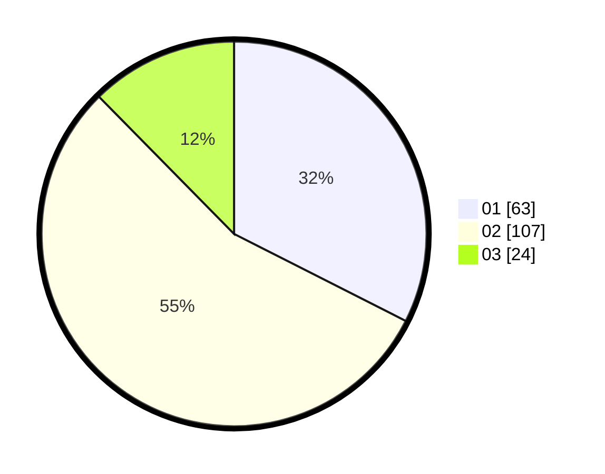

# Hasil

Hasil perolehan suara paslon dapat dilihat pada file paslon-01.txt, paslon-02.txt, dan paslon-03.txt.

Jika tidak ada, artinya data tersebut belum ada pada SIREKAP.

## Perolehan Suara

 * Paslon 01: **63**.
 * Paslon 02: **107**.
 * Paslon 03: **24**.

## Foto C Plano

https://sirekap-obj-formc.kpu.go.id/bbd5/pemilu/ppwp/31/73/02/10/07/3173021007056-20240214-225532--64f3d6e7-d84a-45e6-bdec-224722c8ed18.jpg

https://sirekap-obj-formc.kpu.go.id/bbd5/pemilu/ppwp/31/73/02/10/07/3173021007056-20240214-225544--ec51e625-1ff4-482d-b9c0-4771ad08fa5a.jpg

https://sirekap-obj-formc.kpu.go.id/bbd5/pemilu/ppwp/31/73/02/10/07/3173021007056-20240214-225557--236ab880-3b59-442d-81ff-88f0b7fd6c83.jpg

## DATA PEMILIH TETAP

Jumlah pemilih dalam DPT: **275**.
 * L: **133**.
 * P: **142**.

## DATA PENGGUNA HAK PILIH

Jumlah pengguna hak pilih dalam DPT: **187**.
 * L: **85**.
 * P: **102**.

Jumlah pengguna hak pilih dalam DPTb: **0**.
 * L: **0**.
 * P: **0**.

Jumlah pengguna hak pilih dalam DPK: **11**.
 * L: **5**.
 * P: **6**.

Jumlah pengguna hak pilih: **198**.
 * L: **90**.
 * P: **108**.

## JUMLAH SUARA SAH DAN TIDAK SAH

JUMLAH SELURUH SUARA SAH: **194**.

JUMLAH SUARA TIDAK SAH: **4**.

JUMLAH SELURUH SUARA SAH DAN SUARA TIDAK SAH: **198**.
