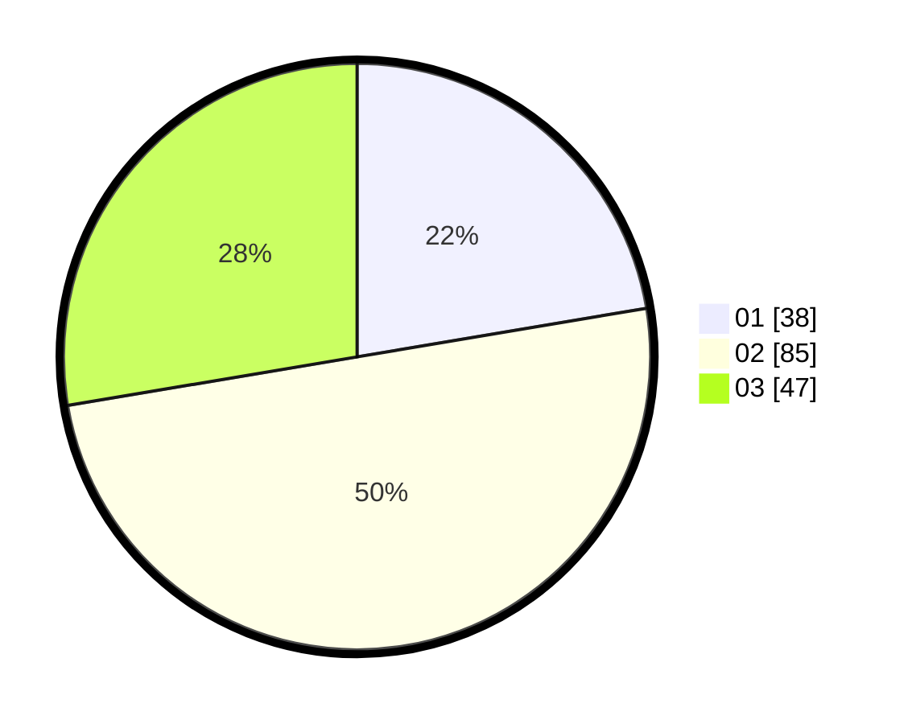

# Hasil

Hasil perolehan suara paslon dapat dilihat pada file paslon-01.txt, paslon-02.txt, dan paslon-03.txt.

Jika tidak ada, artinya data tersebut belum ada pada SIREKAP.

## Perolehan Suara

 * Paslon 01: **38**.
 * Paslon 02: **85**.
 * Paslon 03: **47**.

## Foto C Plano

https://sirekap-obj-formc.kpu.go.id/8338/pemilu/ppwp/31/73/02/10/07/3173021007057-20240214-224952--303234b6-0afa-49c1-bc01-68e2a4df8a52.jpg

https://sirekap-obj-formc.kpu.go.id/8338/pemilu/ppwp/31/73/02/10/07/3173021007057-20240214-224956--b970aafb-b8c1-44ab-bcdf-e32184eb33ca.jpg

https://sirekap-obj-formc.kpu.go.id/8338/pemilu/ppwp/31/73/02/10/07/3173021007057-20240214-224959--fc9b0b9d-afa4-4932-b5e0-5fae80e7568b.jpg
