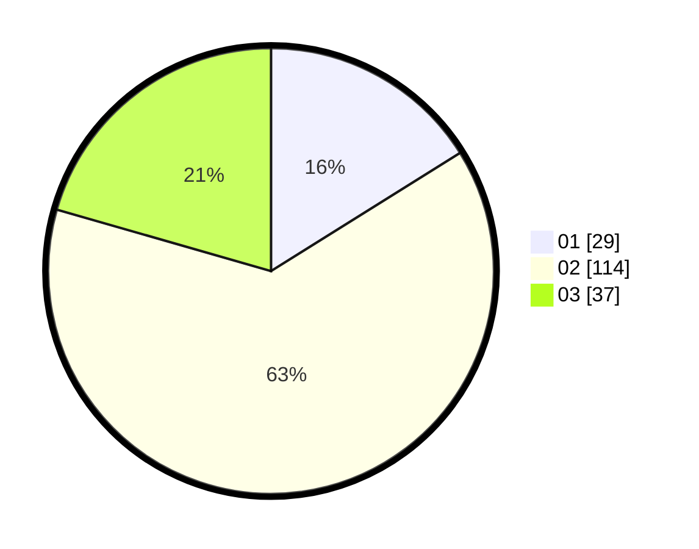

# Hasil

Hasil perolehan suara paslon dapat dilihat pada file paslon-01.txt, paslon-02.txt, dan paslon-03.txt.

Jika tidak ada, artinya data tersebut belum ada pada SIREKAP.

## Perolehan Suara

 * Paslon 01: **29**.
 * Paslon 02: **114**.
 * Paslon 03: **37**.

## Foto C Plano

https://sirekap-obj-formc.kpu.go.id/d568/pemilu/ppwp/31/73/02/10/07/3173021007059-20240214-194519--3d9a094a-16a3-4821-aaae-f6f622754698.jpg

https://sirekap-obj-formc.kpu.go.id/d568/pemilu/ppwp/31/73/02/10/07/3173021007059-20240214-194516--788e8932-a379-493d-b328-0334f2f252d6.jpg

https://sirekap-obj-formc.kpu.go.id/d568/pemilu/ppwp/31/73/02/10/07/3173021007059-20240214-194708--0665f856-afe0-4714-bb1a-50acd9398bf4.jpg

## DATA PEMILIH TETAP

Jumlah pemilih dalam DPT: **226**.
 * L: **114**.
 * P: **112**.

## DATA PENGGUNA HAK PILIH

Jumlah pengguna hak pilih dalam DPT: **167**.
 * L: **82**.
 * P: **85**.

Jumlah pengguna hak pilih dalam DPTb: **11**.
 * L: **8**.
 * P: **3**.

Jumlah pengguna hak pilih dalam DPK: **4**.
 * L: **2**.
 * P: **2**.

Jumlah pengguna hak pilih: **182**.
 * L: **92**.
 * P: **90**.

## JUMLAH SUARA SAH DAN TIDAK SAH

JUMLAH SELURUH SUARA SAH: **180**.

JUMLAH SUARA TIDAK SAH: **2**.

JUMLAH SELURUH SUARA SAH DAN SUARA TIDAK SAH: **182**.
