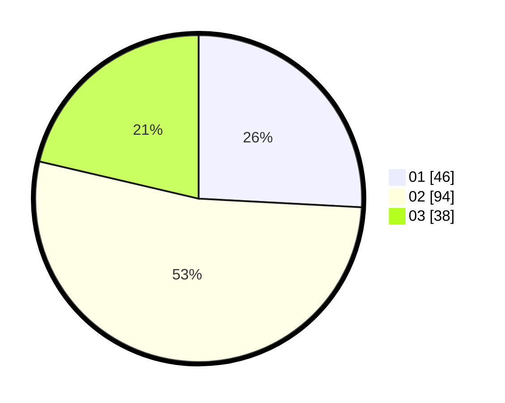

# Hasil

Hasil perolehan suara paslon dapat dilihat pada file paslon-01.txt, paslon-02.txt, dan paslon-03.txt.

Jika tidak ada, artinya data tersebut belum ada pada SIREKAP.

## Perolehan Suara

 * Paslon 01: **46**.
 * Paslon 02: **94**.
 * Paslon 03: **38**.

## Foto C Plano

https://sirekap-obj-formc.kpu.go.id/0a26/pemilu/ppwp/31/73/02/10/07/3173021007061-20240216-013528--93a6fe84-f54c-4d43-ac97-5a3e1ebd3fa3.jpg

https://sirekap-obj-formc.kpu.go.id/0a26/pemilu/ppwp/31/73/02/10/07/3173021007061-20240216-013529--360a6de0-25b7-46d4-8a22-b29410b5b10b.jpg

https://sirekap-obj-formc.kpu.go.id/0a26/pemilu/ppwp/31/73/02/10/07/3173021007061-20240216-013529--1695fa56-67d1-4fe2-8d38-f3f8b4e7a467.jpg

## DATA PEMILIH TETAP

Jumlah pemilih dalam DPT: **252**.
 * L: **134**.
 * P: **118**.

## DATA PENGGUNA HAK PILIH

Jumlah pengguna hak pilih dalam DPT: **173**.
 * L: **91**.
 * P: **82**.

Jumlah pengguna hak pilih dalam DPTb: **5**.
 * L: **4**.
 * P: **1**.

Jumlah pengguna hak pilih dalam DPK: **6**.
 * L: **3**.
 * P: **3**.

Jumlah pengguna hak pilih: **184**.
 * L: **98**.
 * P: **86**.

## JUMLAH SUARA SAH DAN TIDAK SAH

JUMLAH SELURUH SUARA SAH: **178**.

JUMLAH SUARA TIDAK SAH: **6**.

JUMLAH SELURUH SUARA SAH DAN SUARA TIDAK SAH: **184**.
