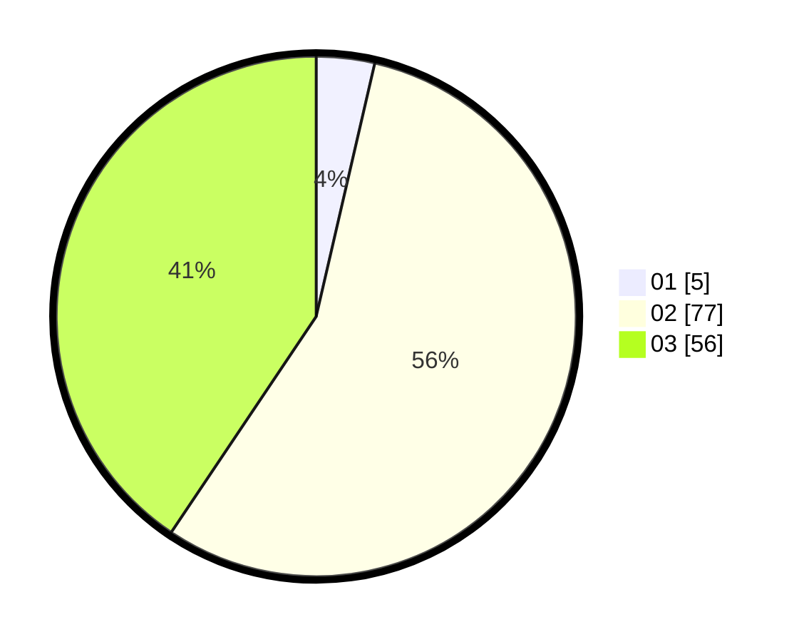

# Hasil

Hasil perolehan suara paslon dapat dilihat pada file paslon-01.txt, paslon-02.txt, dan paslon-03.txt.

Jika tidak ada, artinya data tersebut belum ada pada SIREKAP.

## Perolehan Suara

 * Paslon 01: **5**.
 * Paslon 02: **77**.
 * Paslon 03: **56**.

## Foto C Plano

https://sirekap-obj-formc.kpu.go.id/7a72/pemilu/ppwp/31/73/02/10/07/3173021007063-20240214-234005--ea06ccf4-9ed6-4ed2-90d1-19f207a7eaec.jpg

https://sirekap-obj-formc.kpu.go.id/7a72/pemilu/ppwp/31/73/02/10/07/3173021007063-20240214-234110--92f283d2-06bd-4c80-b6f1-ad978c206a4b.jpg

https://sirekap-obj-formc.kpu.go.id/7a72/pemilu/ppwp/31/73/02/10/07/3173021007063-20240214-234151--1a0fda31-0299-4f96-b06d-a6140f5a2d37.jpg
