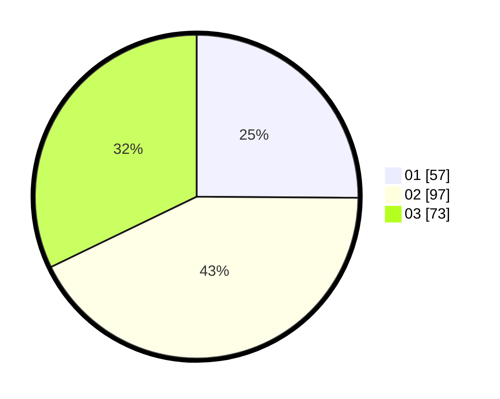

# Hasil

Hasil perolehan suara paslon dapat dilihat pada file paslon-01.txt, paslon-02.txt, dan paslon-03.txt.

Jika tidak ada, artinya data tersebut belum ada pada SIREKAP.

## Perolehan Suara

 * Paslon 01: **57**.
 * Paslon 02: **97**.
 * Paslon 03: **73**.

## Foto C Plano

https://sirekap-obj-formc.kpu.go.id/150e/pemilu/ppwp/31/73/02/10/07/3173021007066-20240216-041326--489eae54-0878-4369-b628-803110df7389.jpg

https://sirekap-obj-formc.kpu.go.id/150e/pemilu/ppwp/31/73/02/10/07/3173021007066-20240216-045838--75e1e543-34a8-4e30-8801-07e6e17099f4.jpg

https://sirekap-obj-formc.kpu.go.id/150e/pemilu/ppwp/31/73/02/10/07/3173021007066-20240216-041328--2d688122-6c8a-4470-ad50-ae4a0464adda.jpg

## DATA PEMILIH TETAP

Jumlah pemilih dalam DPT: **273**.
 * L: **125**.
 * P: **148**.

## DATA PENGGUNA HAK PILIH

Jumlah pengguna hak pilih dalam DPT: **230**.
 * L: **125**.
 * P: **105**.

Jumlah pengguna hak pilih dalam DPTb: **5**.
 * L: **4**.
 * P: **1**.

Jumlah pengguna hak pilih dalam DPK: **1**.
 * L: **0**.
 * P: **1**.

Jumlah pengguna hak pilih: **236**.
 * L: **129**.
 * P: **107**.

## JUMLAH SUARA SAH DAN TIDAK SAH

JUMLAH SELURUH SUARA SAH: **227**.

JUMLAH SUARA TIDAK SAH: **9**.

JUMLAH SELURUH SUARA SAH DAN SUARA TIDAK SAH: **236**.
