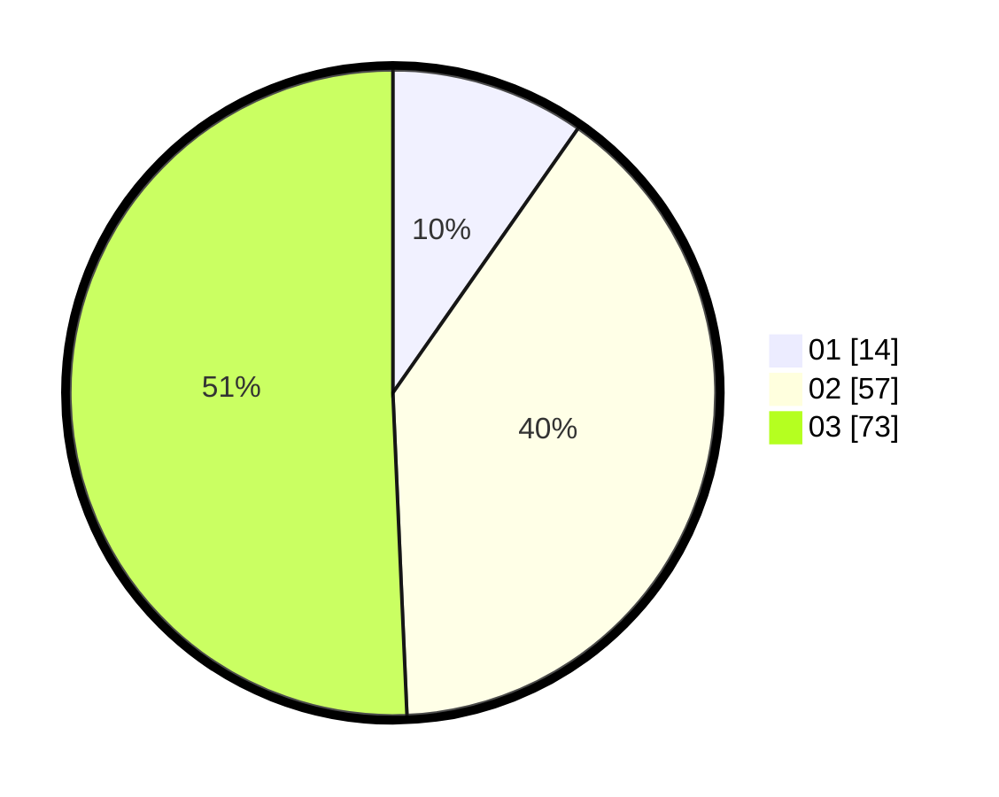

# Hasil

Hasil perolehan suara paslon dapat dilihat pada file paslon-01.txt, paslon-02.txt, dan paslon-03.txt.

Jika tidak ada, artinya data tersebut belum ada pada SIREKAP.

## Perolehan Suara

 * Paslon 01: **14**.
 * Paslon 02: **57**.
 * Paslon 03: **73**.

## Foto C Plano

https://sirekap-obj-formc.kpu.go.id/6bd8/pemilu/ppwp/31/73/02/10/07/3173021007067-20240214-141742--2d918fff-e77b-4ad5-85db-e05ac4493833.jpg

https://sirekap-obj-formc.kpu.go.id/6bd8/pemilu/ppwp/31/73/02/10/07/3173021007067-20240214-155053--ed28a243-8c48-4ab1-a0c4-7918affd1e2a.jpg

https://sirekap-obj-formc.kpu.go.id/6bd8/pemilu/ppwp/31/73/02/10/07/3173021007067-20240214-155456--ae5ec4de-1508-4c9e-9d93-5eda33158462.jpg

## DATA PEMILIH TETAP

Jumlah pemilih dalam DPT: **213**.
 * L: **102**.
 * P: **111**.

## DATA PENGGUNA HAK PILIH

Jumlah pengguna hak pilih dalam DPT: **144**.
 * L: **65**.
 * P: **79**.

Jumlah pengguna hak pilih dalam DPTb: **0**.
 * L: **0**.
 * P: **0**.

Jumlah pengguna hak pilih dalam DPK: **1**.
 * L: **0**.
 * P: **1**.

Jumlah pengguna hak pilih: **145**.
 * L: **65**.
 * P: **80**.

## JUMLAH SUARA SAH DAN TIDAK SAH

JUMLAH SELURUH SUARA SAH: **144**.

JUMLAH SUARA TIDAK SAH: **1**.

JUMLAH SELURUH SUARA SAH DAN SUARA TIDAK SAH: **145**.
