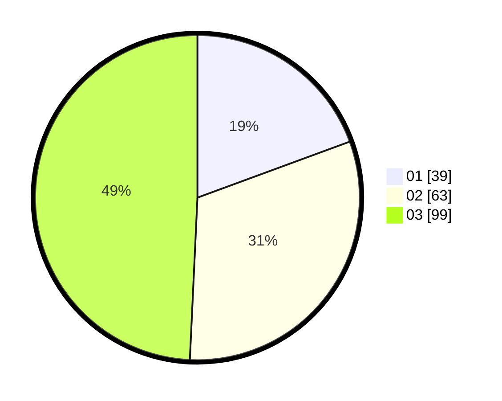

# Hasil

Hasil perolehan suara paslon dapat dilihat pada file paslon-01.txt, paslon-02.txt, dan paslon-03.txt.

Jika tidak ada, artinya data tersebut belum ada pada SIREKAP.

## Perolehan Suara

 * Paslon 01: **39**.
 * Paslon 02: **63**.
 * Paslon 03: **99**.

## Foto C Plano

https://sirekap-obj-formc.kpu.go.id/ed9c/pemilu/ppwp/31/73/02/10/07/3173021007069-20240215-125905--83a35ef7-64d1-42d4-8fdb-499c720ebea5.jpg

https://sirekap-obj-formc.kpu.go.id/ed9c/pemilu/ppwp/31/73/02/10/07/3173021007069-20240215-125928--e9a2bdc4-450b-431a-9020-dd314d35bb60.jpg

https://sirekap-obj-formc.kpu.go.id/ed9c/pemilu/ppwp/31/73/02/10/07/3173021007069-20240214-202342--059f409c-0bf3-4b6e-a863-c297b616fad7.jpg
