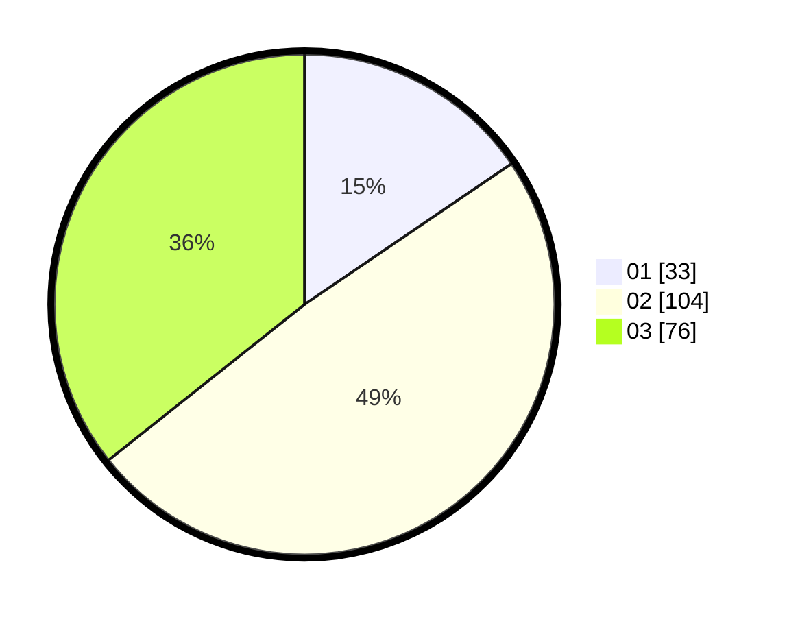

# Hasil

Hasil perolehan suara paslon dapat dilihat pada file paslon-01.txt, paslon-02.txt, dan paslon-03.txt.

Jika tidak ada, artinya data tersebut belum ada pada SIREKAP.

## Perolehan Suara

 * Paslon 01: **33**.
 * Paslon 02: **104**.
 * Paslon 03: **76**.

## Foto C Plano

https://sirekap-obj-formc.kpu.go.id/f7b7/pemilu/ppwp/31/73/02/10/07/3173021007072-20240214-214937--e121a2a1-d6c6-4ad9-86ea-fba7aa765860.jpg

https://sirekap-obj-formc.kpu.go.id/f7b7/pemilu/ppwp/31/73/02/10/07/3173021007072-20240214-200953--bfaacb40-7009-4ebd-865c-2185830a1cc8.jpg

https://sirekap-obj-formc.kpu.go.id/f7b7/pemilu/ppwp/31/73/02/10/07/3173021007072-20240214-201058--c574341d-61de-4342-aea1-a0a33dcb0eaa.jpg

## DATA PEMILIH TETAP

Jumlah pemilih dalam DPT: **277**.
 * L: **127**.
 * P: **150**.

## DATA PENGGUNA HAK PILIH

Jumlah pengguna hak pilih dalam DPT: **210**.
 * L: **98**.
 * P: **112**.

Jumlah pengguna hak pilih dalam DPTb: **0**.
 * L: **0**.
 * P: **0**.

Jumlah pengguna hak pilih dalam DPK: **4**.
 * L: **3**.
 * P: **1**.

Jumlah pengguna hak pilih: **214**.
 * L: **101**.
 * P: **113**.

## JUMLAH SUARA SAH DAN TIDAK SAH

JUMLAH SELURUH SUARA SAH: **213**.

JUMLAH SUARA TIDAK SAH: **1**.

JUMLAH SELURUH SUARA SAH DAN SUARA TIDAK SAH: **214**.
