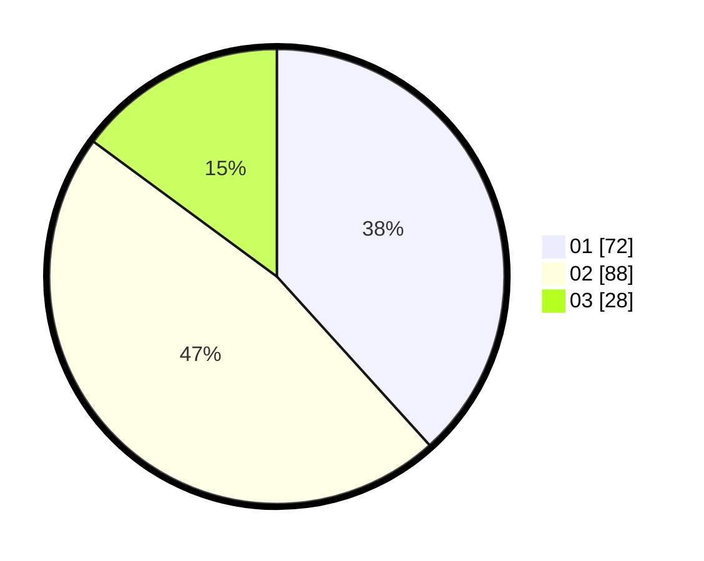

# Hasil

Hasil perolehan suara paslon dapat dilihat pada file paslon-01.txt, paslon-02.txt, dan paslon-03.txt.

Jika tidak ada, artinya data tersebut belum ada pada SIREKAP.

## Perolehan Suara

 * Paslon 01: **72**.
 * Paslon 02: **88**.
 * Paslon 03: **28**.

## Foto C Plano

https://sirekap-obj-formc.kpu.go.id/6daa/pemilu/ppwp/31/73/02/10/07/3173021007073-20240215-235559--0a23ca4b-2cd4-437b-ab86-76051842b861.jpg

https://sirekap-obj-formc.kpu.go.id/6daa/pemilu/ppwp/31/73/02/10/07/3173021007073-20240215-235602--17274a68-b7c2-4491-bee0-ca6e6d8a2a68.jpg

https://sirekap-obj-formc.kpu.go.id/6daa/pemilu/ppwp/31/73/02/10/07/3173021007073-20240215-235600--9824c63e-bbe3-491b-95fe-1f8c50d29082.jpg

## DATA PEMILIH TETAP

Jumlah pemilih dalam DPT: **270**.
 * L: **136**.
 * P: **134**.

## DATA PENGGUNA HAK PILIH

Jumlah pengguna hak pilih dalam DPT: **190**.
 * L: **94**.
 * P: **96**.

Jumlah pengguna hak pilih dalam DPTb: **0**.
 * L: **0**.
 * P: **0**.

Jumlah pengguna hak pilih dalam DPK: **3**.
 * L: **1**.
 * P: **2**.

Jumlah pengguna hak pilih: **193**.
 * L: **95**.
 * P: **98**.

## JUMLAH SUARA SAH DAN TIDAK SAH

JUMLAH SELURUH SUARA SAH: **188**.

JUMLAH SUARA TIDAK SAH: **5**.

JUMLAH SELURUH SUARA SAH DAN SUARA TIDAK SAH: **193**.
