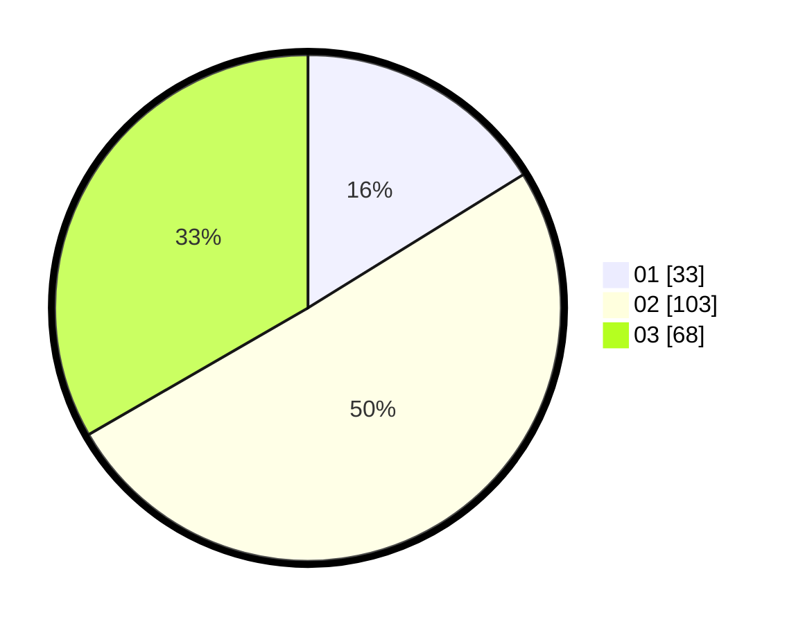

# Hasil

Hasil perolehan suara paslon dapat dilihat pada file paslon-01.txt, paslon-02.txt, dan paslon-03.txt.

Jika tidak ada, artinya data tersebut belum ada pada SIREKAP.

## Perolehan Suara

 * Paslon 01: **33**.
 * Paslon 02: **103**.
 * Paslon 03: **68**.

## Foto C Plano

https://sirekap-obj-formc.kpu.go.id/2567/pemilu/ppwp/31/73/02/10/07/3173021007079-20240215-210301--2cdb7313-d9ab-4efb-8832-f06d62a94697.jpg

https://sirekap-obj-formc.kpu.go.id/2567/pemilu/ppwp/31/73/02/10/07/3173021007079-20240214-200258--7f0e5d48-ebe8-413f-932a-a83c3806f9f2.jpg

https://sirekap-obj-formc.kpu.go.id/2567/pemilu/ppwp/31/73/02/10/07/3173021007079-20240215-210302--11f71a2b-3845-44a6-becb-bd9f69f33fc1.jpg

## DATA PEMILIH TETAP

Jumlah pemilih dalam DPT: **278**.
 * L: **143**.
 * P: **135**.

## DATA PENGGUNA HAK PILIH

Jumlah pengguna hak pilih dalam DPT: **196**.
 * L: **99**.
 * P: **97**.

Jumlah pengguna hak pilih dalam DPTb: **6**.
 * L: **2**.
 * P: **4**.

Jumlah pengguna hak pilih dalam DPK: **3**.
 * L: **2**.
 * P: **1**.

Jumlah pengguna hak pilih: **205**.
 * L: **103**.
 * P: **102**.

## JUMLAH SUARA SAH DAN TIDAK SAH

JUMLAH SELURUH SUARA SAH: **204**.

JUMLAH SUARA TIDAK SAH: **1**.

JUMLAH SELURUH SUARA SAH DAN SUARA TIDAK SAH: **205**.
