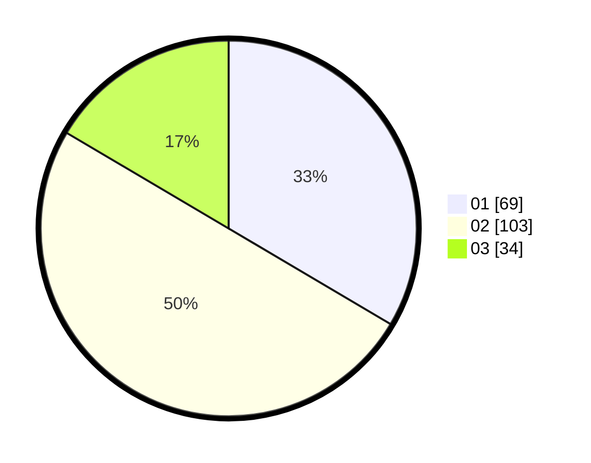

# Hasil

Hasil perolehan suara paslon dapat dilihat pada file paslon-01.txt, paslon-02.txt, dan paslon-03.txt.

Jika tidak ada, artinya data tersebut belum ada pada SIREKAP.

## Perolehan Suara

 * Paslon 01: **69**.
 * Paslon 02: **103**.
 * Paslon 03: **34**.

## Foto C Plano

https://sirekap-obj-formc.kpu.go.id/a1e2/pemilu/ppwp/31/73/02/10/07/3173021007080-20240216-004320--1349c78e-cf81-49f9-8919-e3492159bbb6.jpg

https://sirekap-obj-formc.kpu.go.id/a1e2/pemilu/ppwp/31/73/02/10/07/3173021007080-20240216-004331--faad310a-3c3a-46f8-8115-f5ae7d28bd6b.jpg

https://sirekap-obj-formc.kpu.go.id/a1e2/pemilu/ppwp/31/73/02/10/07/3173021007080-20240216-004327--c21dcb66-5b4d-4be2-acac-ee2e722b5db4.jpg

## DATA PEMILIH TETAP

Jumlah pemilih dalam DPT: **275**.
 * L: **138**.
 * P: **137**.

## DATA PENGGUNA HAK PILIH

Jumlah pengguna hak pilih dalam DPT: **188**.
 * L: **96**.
 * P: **92**.

Jumlah pengguna hak pilih dalam DPTb: **17**.
 * L: **11**.
 * P: **6**.

Jumlah pengguna hak pilih dalam DPK: **1**.
 * L: **1**.
 * P: **0**.

Jumlah pengguna hak pilih: **206**.
 * L: **108**.
 * P: **98**.

## JUMLAH SUARA SAH DAN TIDAK SAH

JUMLAH SELURUH SUARA SAH: **206**.

JUMLAH SUARA TIDAK SAH: **0**.

JUMLAH SELURUH SUARA SAH DAN SUARA TIDAK SAH: **206**.
