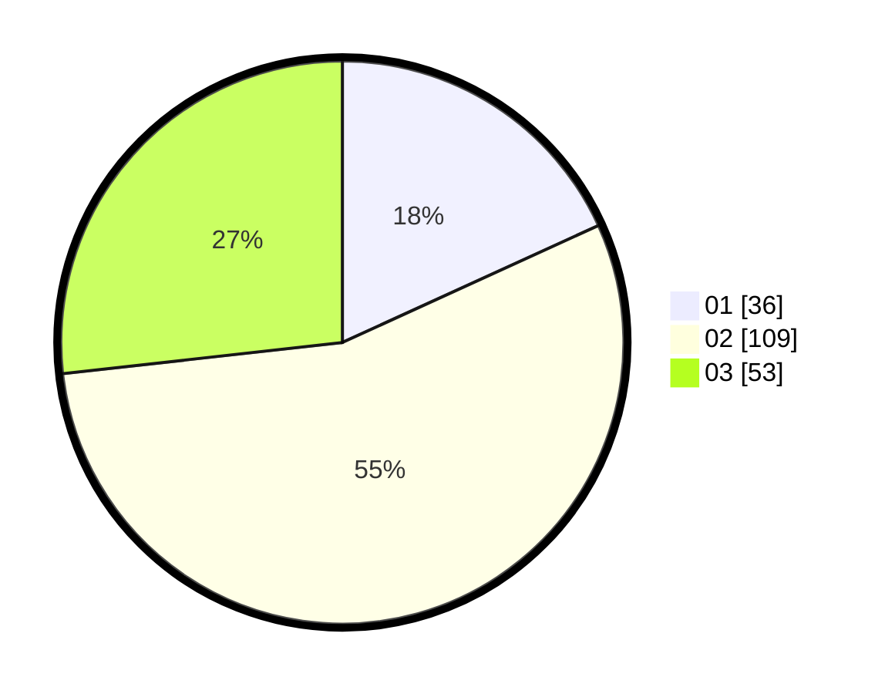

# Hasil

Hasil perolehan suara paslon dapat dilihat pada file paslon-01.txt, paslon-02.txt, dan paslon-03.txt.

Jika tidak ada, artinya data tersebut belum ada pada SIREKAP.

## Perolehan Suara

 * Paslon 01: **36**.
 * Paslon 02: **109**.
 * Paslon 03: **53**.

## Foto C Plano

https://sirekap-obj-formc.kpu.go.id/5150/pemilu/ppwp/31/73/02/10/07/3173021007083-20240214-234501--563a146f-f8b2-477f-973b-9ef596c66a9d.jpg

https://sirekap-obj-formc.kpu.go.id/5150/pemilu/ppwp/31/73/02/10/07/3173021007083-20240214-234822--26a5db78-d731-4006-8117-820a2cb9f73c.jpg

https://sirekap-obj-formc.kpu.go.id/5150/pemilu/ppwp/31/73/02/10/07/3173021007083-20240216-045909--65d1a127-06ea-42ac-be50-b966a2e53989.jpg
