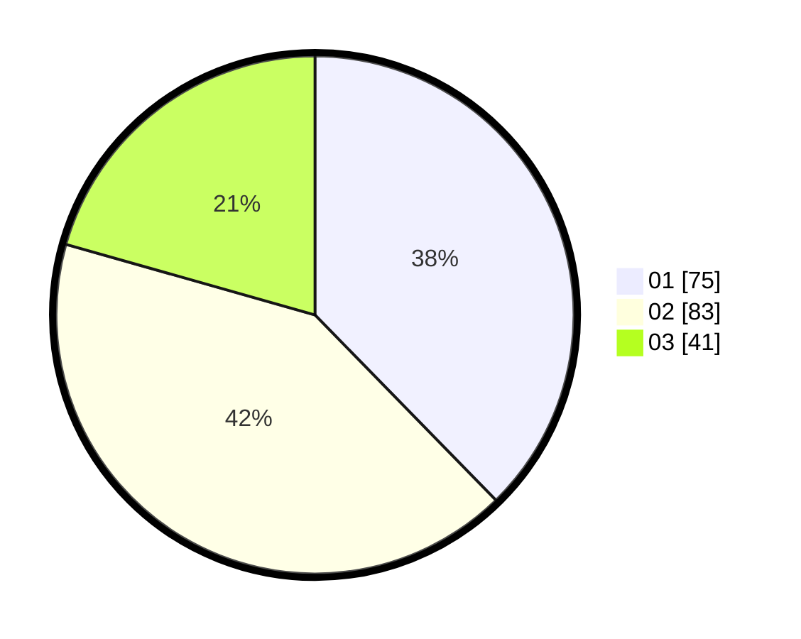

# Hasil

Hasil perolehan suara paslon dapat dilihat pada file paslon-01.txt, paslon-02.txt, dan paslon-03.txt.

Jika tidak ada, artinya data tersebut belum ada pada SIREKAP.

## Perolehan Suara

 * Paslon 01: **75**.
 * Paslon 02: **83**.
 * Paslon 03: **41**.

## Foto C Plano

https://sirekap-obj-formc.kpu.go.id/54c4/pemilu/ppwp/31/73/02/10/07/3173021007086-20240214-210147--22a1aa99-3ccc-48b8-ad6c-b942c0dda65c.jpg

https://sirekap-obj-formc.kpu.go.id/54c4/pemilu/ppwp/31/73/02/10/07/3173021007086-20240214-210019--81d3ba33-7310-458c-99d2-1db2bec4484d.jpg

https://sirekap-obj-formc.kpu.go.id/54c4/pemilu/ppwp/31/73/02/10/07/3173021007086-20240214-210306--fbb42e35-865f-4827-86f6-90299c84532d.jpg

## DATA PEMILIH TETAP

Jumlah pemilih dalam DPT: **285**.
 * L: **147**.
 * P: **138**.

## DATA PENGGUNA HAK PILIH

Jumlah pengguna hak pilih dalam DPT: **200**.
 * L: **101**.
 * P: **99**.

Jumlah pengguna hak pilih dalam DPTb: **0**.
 * L: **0**.
 * P: **0**.

Jumlah pengguna hak pilih dalam DPK: **3**.
 * L: **1**.
 * P: **2**.

Jumlah pengguna hak pilih: **203**.
 * L: **102**.
 * P: **101**.

## JUMLAH SUARA SAH DAN TIDAK SAH

JUMLAH SELURUH SUARA SAH: **200**.

JUMLAH SUARA TIDAK SAH: **3**.

JUMLAH SELURUH SUARA SAH DAN SUARA TIDAK SAH: **203**.
