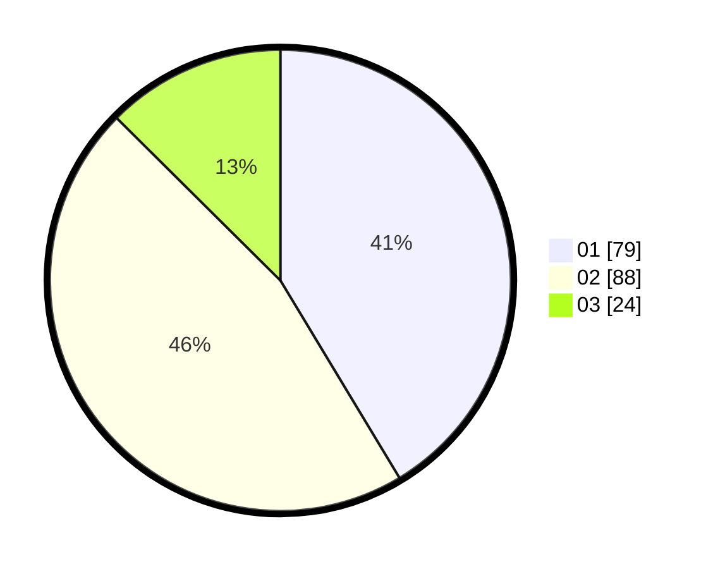

# Hasil

Hasil perolehan suara paslon dapat dilihat pada file paslon-01.txt, paslon-02.txt, dan paslon-03.txt.

Jika tidak ada, artinya data tersebut belum ada pada SIREKAP.

## Perolehan Suara

 * Paslon 01: **79**.
 * Paslon 02: **88**.
 * Paslon 03: **24**.

## Foto C Plano

https://sirekap-obj-formc.kpu.go.id/b87d/pemilu/ppwp/31/73/02/10/07/3173021007088-20240214-155717--c0074e4b-71b5-45b5-b963-f29d85954bbf.jpg

https://sirekap-obj-formc.kpu.go.id/b87d/pemilu/ppwp/31/73/02/10/07/3173021007088-20240214-155827--17b58d5a-a224-404a-aa6a-854fa2adf288.jpg

https://sirekap-obj-formc.kpu.go.id/b87d/pemilu/ppwp/31/73/02/10/07/3173021007088-20240214-160055--b66123e5-3683-48d1-8ce5-fc237f64e32e.jpg

## DATA PEMILIH TETAP

Jumlah pemilih dalam DPT: **282**.
 * L: **150**.
 * P: **132**.

## DATA PENGGUNA HAK PILIH

Jumlah pengguna hak pilih dalam DPT: **193**.
 * L: **94**.
 * P: **99**.

Jumlah pengguna hak pilih dalam DPTb: **0**.
 * L: **0**.
 * P: **0**.

Jumlah pengguna hak pilih dalam DPK: **3**.
 * L: **2**.
 * P: **1**.

Jumlah pengguna hak pilih: **196**.
 * L: **96**.
 * P: **100**.

## JUMLAH SUARA SAH DAN TIDAK SAH

JUMLAH SELURUH SUARA SAH: **191**.

JUMLAH SUARA TIDAK SAH: **5**.

JUMLAH SELURUH SUARA SAH DAN SUARA TIDAK SAH: **196**.
