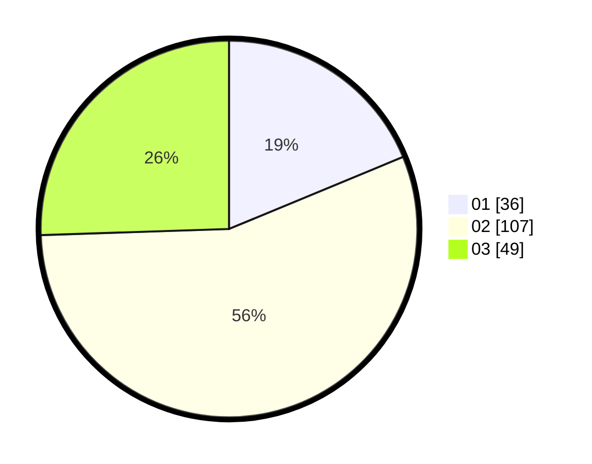

# Hasil

Hasil perolehan suara paslon dapat dilihat pada file paslon-01.txt, paslon-02.txt, dan paslon-03.txt.

Jika tidak ada, artinya data tersebut belum ada pada SIREKAP.

## Perolehan Suara

 * Paslon 01: **36**.
 * Paslon 02: **107**.
 * Paslon 03: **49**.

## Foto C Plano

https://sirekap-obj-formc.kpu.go.id/1318/pemilu/ppwp/31/73/02/10/07/3173021007091-20240216-063706--b1d9577c-493e-420c-a693-8f220ee01080.jpg

https://sirekap-obj-formc.kpu.go.id/1318/pemilu/ppwp/31/73/02/10/07/3173021007091-20240216-063709--5a0cad84-0fce-4ac1-8341-46e349e3e018.jpg

https://sirekap-obj-formc.kpu.go.id/1318/pemilu/ppwp/31/73/02/10/07/3173021007091-20240216-063708--23bfc039-3aa2-43d3-8628-3ea69dc5106d.jpg

## DATA PEMILIH TETAP

Jumlah pemilih dalam DPT: **276**.
 * L: **152**.
 * P: **124**.

## DATA PENGGUNA HAK PILIH

Jumlah pengguna hak pilih dalam DPT: **187**.
 * L: **102**.
 * P: **85**.

Jumlah pengguna hak pilih dalam DPTb: **5**.
 * L: **2**.
 * P: **3**.

Jumlah pengguna hak pilih dalam DPK: **1**.
 * L: **1**.
 * P: **0**.

Jumlah pengguna hak pilih: **193**.
 * L: **105**.
 * P: **88**.

## JUMLAH SUARA SAH DAN TIDAK SAH

JUMLAH SELURUH SUARA SAH: **192**.

JUMLAH SUARA TIDAK SAH: **1**.

JUMLAH SELURUH SUARA SAH DAN SUARA TIDAK SAH: **193**.
