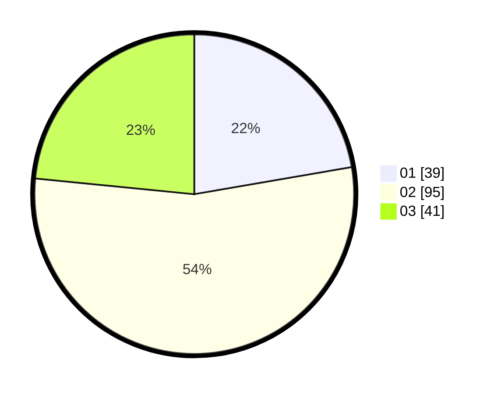

# Hasil

Hasil perolehan suara paslon dapat dilihat pada file paslon-01.txt, paslon-02.txt, dan paslon-03.txt.

Jika tidak ada, artinya data tersebut belum ada pada SIREKAP.

## Perolehan Suara

 * Paslon 01: **39**.
 * Paslon 02: **95**.
 * Paslon 03: **41**.

## Foto C Plano

https://sirekap-obj-formc.kpu.go.id/8772/pemilu/ppwp/31/73/02/10/07/3173021007092-20240216-104908--2e22d1ee-bcb5-489b-b601-8c1d48459829.jpg

https://sirekap-obj-formc.kpu.go.id/8772/pemilu/ppwp/31/73/02/10/07/3173021007092-20240216-104514--43ccafdc-13e5-4f56-acf1-366b1f0e9d6b.jpg

https://sirekap-obj-formc.kpu.go.id/8772/pemilu/ppwp/31/73/02/10/07/3173021007092-20240216-104510--9e4ba0cd-68aa-4706-9e83-7ad3dddae574.jpg

## DATA PEMILIH TETAP

Jumlah pemilih dalam DPT: **282**.
 * L: **146**.
 * P: **136**.

## DATA PENGGUNA HAK PILIH

Jumlah pengguna hak pilih dalam DPT: **171**.
 * L: **79**.
 * P: **92**.

Jumlah pengguna hak pilih dalam DPTb: **2**.
 * L: **0**.
 * P: **2**.

Jumlah pengguna hak pilih dalam DPK: **3**.
 * L: **1**.
 * P: **2**.

Jumlah pengguna hak pilih: **176**.
 * L: **80**.
 * P: **96**.

## JUMLAH SUARA SAH DAN TIDAK SAH

JUMLAH SELURUH SUARA SAH: **175**.

JUMLAH SUARA TIDAK SAH: **1**.

JUMLAH SELURUH SUARA SAH DAN SUARA TIDAK SAH: **176**.
