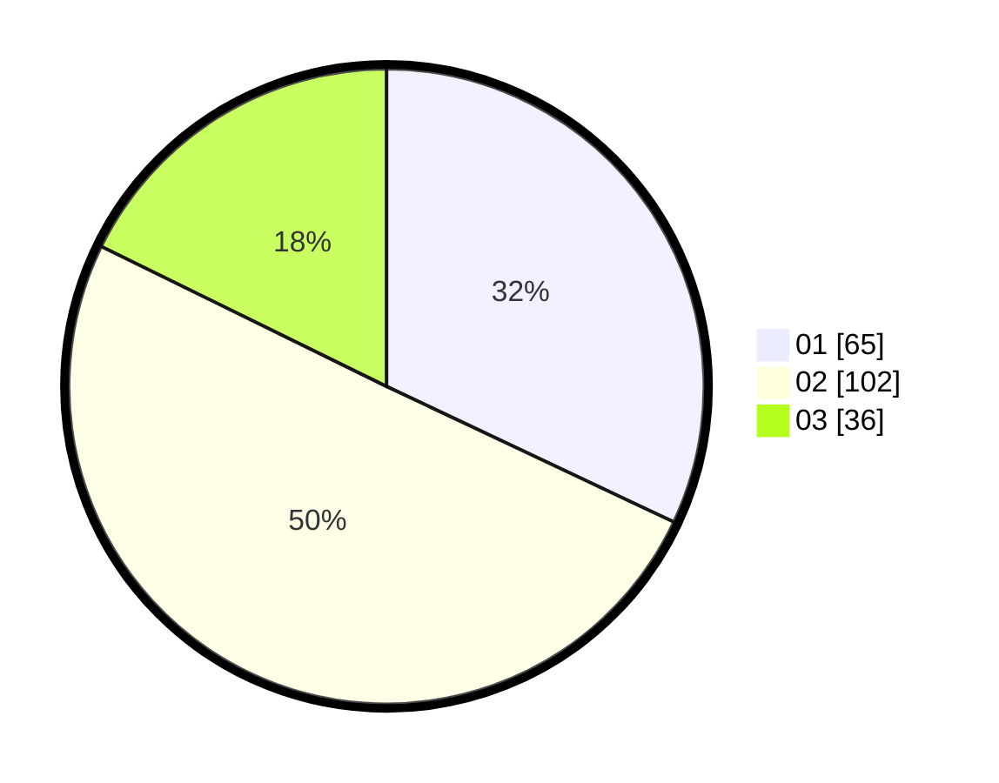

# Hasil

Hasil perolehan suara paslon dapat dilihat pada file paslon-01.txt, paslon-02.txt, dan paslon-03.txt.

Jika tidak ada, artinya data tersebut belum ada pada SIREKAP.

## Perolehan Suara

 * Paslon 01: **65**.
 * Paslon 02: **102**.
 * Paslon 03: **36**.

## Foto C Plano

https://sirekap-obj-formc.kpu.go.id/dbf1/pemilu/ppwp/31/73/02/10/07/3173021007093-20240215-011603--34c1aa74-f1f6-405e-bf55-66f1eecf9485.jpg

https://sirekap-obj-formc.kpu.go.id/dbf1/pemilu/ppwp/31/73/02/10/07/3173021007093-20240215-011635--e76d868f-8b9f-4d14-a769-e3e8fb9113c8.jpg

https://sirekap-obj-formc.kpu.go.id/dbf1/pemilu/ppwp/31/73/02/10/07/3173021007093-20240215-020936--441543d8-09c5-40c7-b25b-773dae3c5160.jpg
